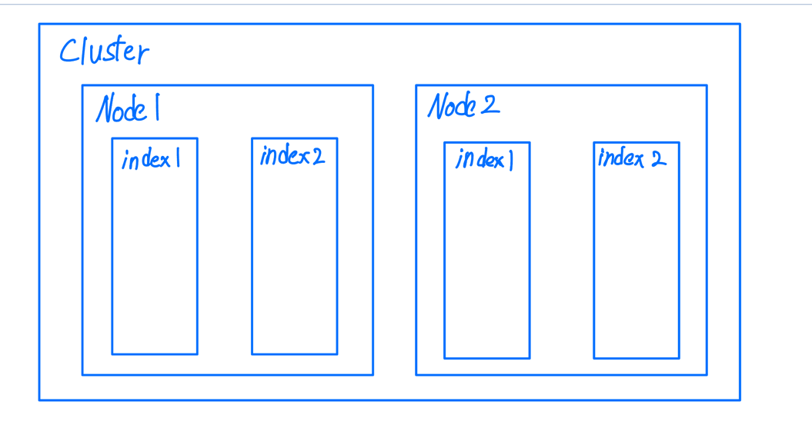
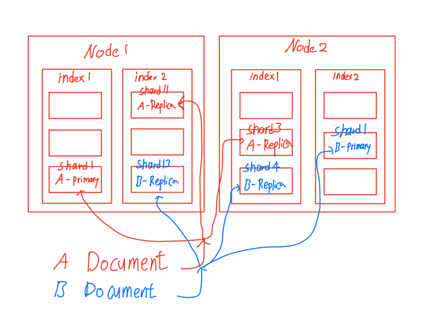
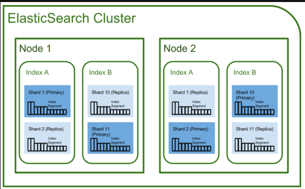
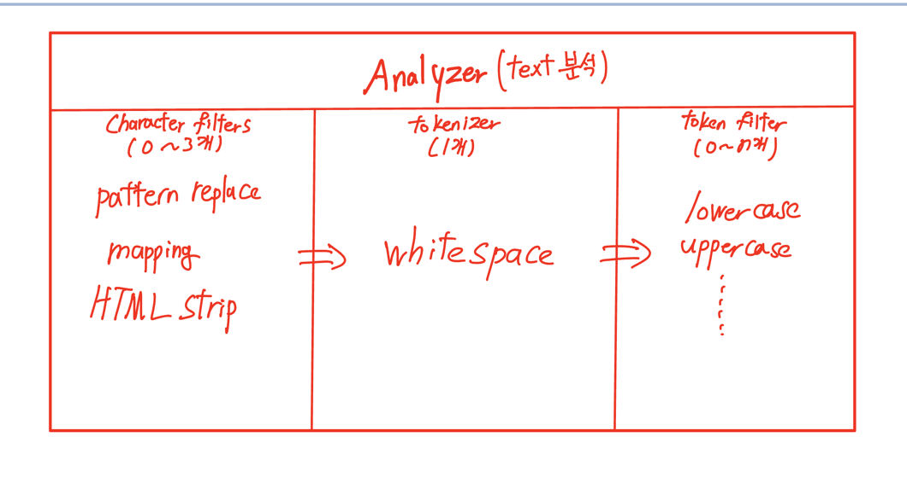
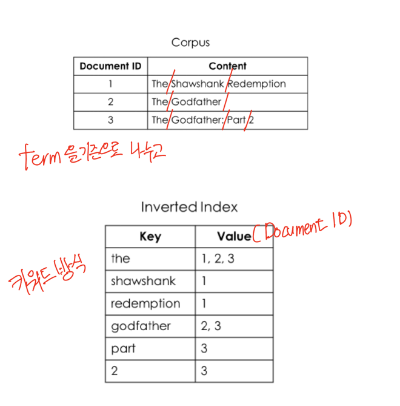

# Elastic Search
해당 문서는 <br>
Elastic 가이드북 - https://esbook.kimjmin.net/ <br>
Elastic Search 인프런 강의 - https://www.inflearn.com/course/elasticsearch-essential/dashboard <br>
를 기반으로 작성되었습니다

## Elastic Search 란?
Apache Lucene 이라는 검색 기능을 제공해주는 자바 라이브러리를 기반으로 만든 오픈 소스 검색 엔진입니다 <br>
JSON 기반의 문서를 저장하고 검색하는 것이 가능하며 해당 데이터들을 분석하는 작업 또한 가능합니다 <br>
elasticsearch 는 검색을 위해서 단독으로도 사용하는 것이 가능하기도 하고 ELK(Elasticserch, Logstatsh, Kibana)로 조합해서 사용하는 것도 가능합니다 <br>
조합해서 사용하게 되면 흐름은 이렇습니다 <br>
1. logstash : 로그나 데이터를 수집/집계/파싱 후 elasticsearch 로 전달
2. elasticsearch : logstash 로부터 전달받은 데이터를 검색/집계
3. kibana : elasticsearch 의 검색으로 수집한 데이터를 시각화 / 모니터링


Elasticsearch 의 특징으로는 아래와 같은 내용이 있습니다
- realtime 검색 시스템
  - Elasticsearch 클러스터가 돌고 있는 동안 검색과 데이터의 적재가 거의 동시에 일어나고 있기 때문에 엄청나게 빠른 속도를 자랑합니다
- 클러스터 구조
  - 하나 이상의 노드로 구성해서 데이터 관리, 검색에서 높은 수준의 안정성을 보여줄 수 있으며 부하의 분산도 가능합니다 
- Rest API 기반의 인터페이스
  - 단순하게 Elasticsearch 서버에 api 을 쏘는 방식으로 데이터를 입력, 조회, 수정 등 다양한 elasticsearch의 기능들을 시용하는 것이 가능합니다
- 동적 스키마 생성
  - RDBMS 와 비교해서 생각해보면, 스키마를 생성하고 데이터를 적재하는 방식이 아니라 동적으로 생성하기 때문에 따로 미리 정의할 필요가 없습니다

<br><br>

## Elastic Search 의 기본 개념

### ES의 시스템 구조
간단한 도식화

<br>
Elasticsearch 는 **클러스터링 구조**를 가지고 있으면서 클러스터 내부에서는 **여러개의 노드**로 나뉘어져있으며, <br>
각각의 노드 안에는 **인덱스**들이 구성되어 있습니다 <br><br><br>


#### 클러스터
위키백과에서는 '컴퓨터 클러스터는 여러 대의 컴퓨터들이 연결되어 하나의 시스템처럼 동작하는 컴퓨터들의 집합을 말한다' 라고 정의되어 있습니다 <br>
ES을 가장 밖에서 봤을 떄의 구조라고 볼 수 있습니다 <br>

<br><br>

##### 노드
클러스터 내부에 구성되어 있는 각각의 기능을 가진 하나의 단위라고 볼 수 있습니다 <br>
각각의 노드는 가장 많이 사용하는 종류로 나누어 4개로 나눌 수 있습니다 <br>
- 마스터 노드 : 클러스터 상태 관리 및 메타 데이터 관리
  - 인덱스 생성/삭제, 데이터를 샤드에 분배
  - 마스터 노드가 있어도 마스터 노드가 뻗는 경우에 다음 마스터 노드를 설정할 수 있도록 **후보 마스터 노드**를 가질 것인지에 대한 여부를 설정할 수 있습니다
- 데이터 노드 : 문서 색인 및 검색 요청 처리
  - 해당 노드에 데이터를 저장할 것인지 지정하는 것이 가능합니다
- 코디네이팅 노드 : 데이터, 마스터 노드의 일을 대신할 수 있는 노드 > 로드밸런싱처럼 대규모 클러스터 구조에서 유용
- 인제스트 노드 : 색인되는 문서의 데이터 전처리

<br>

클러스터 구조를 가져가고 있는 ES이기 떄문에 가지는 특징들도 있습니다. <br>
위에서 정의한 노드들의 4가지 기능들은 뭐 각각의 특징을 가지고 있다고는 했지만 사실 모든 각각의 노드들은 위에서 정의한 모든 역할을 수행하는 것이 가능합니다 <br>
그렇기 때문에 기본적으로는 >> 어떤 노드에게 요청을 하던지 모든 노드는 **동일한 결과**를 돌려줄 것이라는 것입니다 <br>
<br>

위에서 많이 쓰인다고 언급한 각각의 노드의 각 기능들은 config 에서 true/false 값의 조정을 통해서 설정하는 것이 가능한데 <br>
각 노드에 각각의 기능을 설정하는 작업을 통해서 각 노드에서 모든 기능을 수행하는 것이 아닌 MSA 와 같이 각각의 독립적인 기능을 한 노드를 구성하는 것이 가능합니다 <br>
해당 작업의 의의는 노드밸런싱을 통해서 각 노드별로 부하가 가지 않도록 처리하고 각 노드에 맞게 라우팅해주는 작업이 필요합니다 <br>
<br><br>


#### 인덱스와 샤드
요기 부분은 실제로 데이터가 들어가는 부분에 대한 내용이기 때문에 RDBMS와 비교한 용어를 보면 편할 것 같아서 정리해봤습니다
<table>
  <tr>
    <th>RDBMS</th>
    <th>ES</th>
  </tr>
  <tr>
    <td>database</td>
    <td>index</td>
  </tr>
  <tr>
    <td>schema</td>
    <td>mapping</td>
  </tr>
    <tr>
    <td>row</td>
    <td>document</td>
  </tr>
</table>

<br>

위의 표를 정리해보면 ES 에서는 RDBMS에서 저장되는 데이터를 보고 document 이라고 명명하고 있으며 <br>
document를 모아둔 집합을 보고 인덱스라고 명명하고 있습니다<br>

**인덱스란** <br>
document가 저장되는 논리적인 공간이고 인덱스가 구성이 되어있어야만 document을 저장하는 것이 가능합니다 <br>
인덱스를 설계하는 것이 ES을 사용하는데 가장 고려가 필요한 부분이라고 합니다 <br>

<br>
예시) <br>
book, magazine, dvd 이러한 개념들이 있다고 가정해봅시다 <br>
이들을 각각의 index으로 저장할 것인지 vs library 이라는 공통된 index 으로 저장할 것인지 <br>
나눈다면 > 관리 리소스가 요하지만 쿼리나 문서구조가 간단 <br>
통합한다면 > 관리적인 관점에서는 편리하지만, 쿼리나 문서구조를 포기 <br>
강의에서는 우선 저장하고자 하는 애의 통합적인 것으로 구조를 잡아두고 쪼개는 방식을 추천 <br>
<br>


**샤드란** <br>
인덱스에 색인되는 문서가 저장되는 공간이고 하나의 인덱스는 반드시 하나 이상의 샤드를 갖습니다 <br>
따라서 인덱스(1)는 (n)개의 샤드로 분리되어 각 노드에 분산되어 저장되게 됩니다 <br>
+샤드는 ES의 기반인 루씬(Lucene)의 단일 검색 인스턴스
<br><br>

샤드의 종류는 크게 프라이머리 / 레플리카 이렇게 나뉘어집니다 <br>
프라이머리는 document가 저장되는 원본 샤드이고, 해당 샤드는 색인과 검색 성능 모두에게 큰 영향을 줍니다 <br>
레플리카는 프라이머리의 복제 샤드이고, 복제된 샤드이기 때문에 검색 성능에 영향을 끼지는 샤드이고 만약 프라이머리에 문제가 생긴다면 프라이머리가 될 수도 있습니다 <br>
<br>



왜 나뉘어있을까? <br>
레플리카가 만들어지게 되면 프라이머리와 동일한 노드에 구성되는 것이 아닌 반드시 다른 노드에 구성되어 있습니다 <br>
그것은 노드의 상태가 망가지는 케이스에는 노드 내부 인덱스에 나뉘어있는 샤드들이 전부 망가지는데 망가져도 데이터의 신뢰성을 위해 다른 노드에 저장하기 위해서입니다 <br>
그래야 위에서 언급한 내용인 프라이머리에 문제가 생기면 레플리카에서 프라이머리로 승격하는 것이 가능합니다(승격하면서 새로운 레플리카를 생성합니다) <br>
추가로 ES에서는 아무리 작은 클러스터 구조여도 최소 3개의 노드를 구성할 것을 권장하고 있습니다 <br>
<br>

샤드의 갯수 설정은 인덱스를 생성하는 시점에 지정합니다 <br>
인덱스를 생성할 떄 > settings 항목에 number_of_shards, number_of_replicas 두 항목을 통해서 설정할 수 있습니다 <br>
인덱스 생성 시, 샤드의 갯수를 지정하는 과정에서 가장 중요한 항목은 > **프라이머리 샤드의 갯수는 인덱스를 처음 생성하는 시점에만 지정할 수 있다는 것**입니다 <br>
기본 값으로는 number_of_shards 가 1인데, 1 그대로 사용하게 되면 성능 상 문제가 될 수 있다고 하는데 예시 및 실습이 좀 필요할 듯합니다 <br>
+일일이 인덱스 생성할 때마다 이것을 조절하는 것은 어려울 것으로 보이니 인덱스 템플릿으로 공통화해서 작업하는 것도 가능 <br>
number_of_shards 는 프라이머리 샤드의 갯수 <br>
number_of_replicas 는 복제 샤드의 갯수 <br>
그럼 복제 샤드는 프라이머리 샤드 하나 당 나오는 구조이기 때문에 총 샤드의 갯수는 number_of_shards * number_of_replicas 로 볼 수 있습니다 <br>

정리해서 보면 <br>
레플리카가 많은 경우에는 데이터 색인 시 > 많은 레플리카에 데이터나 나뉘어져서 들어가야 하기 떄문에 색인 성능은 떨어지고 검색 성능이 빨라진다고 볼 수 있습니다 <br>
레플리카의 수가 부족한 경우에는 색인 시 > 색인을 나누어서 저장해야하는 데이터의 양이 없기 떄문에 색인 성능은 빠르지만 검색 성능이 떨어진다고 볼 수 있습니다 <br>
따라서 샤드의 수를 지정하는데 있어서 색인/검색 성능 중에서 어떤 것에 중점을 두느냐가 숫자를 어떻게 구성할 것인지에 지표가 될 것이라고 생각합니다 <br>
<br>

성능을 확인하는데 있어서 이렇게 샤드의 수를 고민하고, 노드의 분산이 기능별로 잘 나뉘어 있는지, 각 데이터 노드들에 데이터가 잘 분산되어 저장되어 있는지에 대해서 확인하는 것이 중요하다고 생각합니다 <br>

<br><br>

결과적으로 지금까지 확인한 사항을 보고 위에 raw하게 그린 항목에 내용을 집어넣어 ES의 총괄적 구조를 보면 <br>
이렇게 볼 수 있습니다 <br>

<br>

<br><br>

# ES의 데이터 처리
인덱스는 모든 데이터 관련 정보들의 기본 단위가 됩니다 <br>
인덱스가 각 샤드로 나뉘어지면서 여러 노드에 저장이 되는데, 각각의 인덱스별로 데이터의 저장 및 검색 방법에 대해서 고려하게 되어 있습니다 <br>
크게 인덱스의 설정과정, 매핑과정으로 나누어서 볼 수 있습니다 <br>
<br>

## 인덱스의 설정(_setting)
인덱스의 설정 같은 경우에는 위에서 잠깐 언급되었던 해당 인덱스를 샤드에 배치하는 과정에서 샤드의 설정을 하는 number_of_shards, number_of_replicas 가 가장 대표적인 설정입니다 <br>
설정하는 예시를 보면 요런 방식으로 설정합니다 <br>
```
PUT my_index
{
  "settings": {
    "index": {
      "number_of_shards": 3,
      "number_of_replicas": 1
    }
  }
}
```
<br>
이외에도 아래와 같은 설정들이 존재합니다  

- refresh_interval : 세그먼트(샤드에 다수의 세그먼트로 나뉘어져있음 - 검색하는데 사용)가 만들어지는 리프레시 타임(defaut 1), replica 설정 수와 동일하게 동적으로 설정하는 것이 가능(떠 있는 상태에서 설정 가능)
- analyzer : 색인 받은 문장을 분석하는 작업 주로 진행할 기능을 가진 부분
- tokenizer : 데이터 색인 과정에서 검색 기능에 가장 많은 영향을 미치는 부분(반드시 하나만 사용)
- filter : 문장을 단어로 쪼개고 나서 쪼갠 단어들을 처리하는 과정에서 해당 파트에서 지정한 규칙을 기준으로 처리

<br> <br>
인덱스별로 가장 많이 보이는 기능들은 위와 같고, 각각의 커스터마이징을 통해서 지정하는 것이 가능하기 때문에 필요할 떄 확인 및 사용이 필요합니다 <br> 
공식 페이지를 보고 참고하면 좋을 것 같습니다 <br>
https://www.elastic.co/guide/en/elasticsearch/reference/current/indices-update-settings.html
<br><br>


## 매핑(_mapping)
매핑이라는 단어는 위에서 RDBMS 와 비교 할떄 잠깐 보였는데 ES에서의 mapping = RDBMS에서의 schema 라고 볼 수 있습니다 <br>
매핑에는 크게 2가지 방식이 있습니다 > 동적 매핑, 정적 매핑 <br> 
- 동적 매핑은 처음 색인되는 문서를 바탕으로 매핑정보를 ES가 동적으로 알아서 매핑
- 정적 매핑은 RDBMS 에서 진행했던 방식처럼 데이터에 대한 타입을 미리 지정해주고 해당 타입만 색인될 수 있도록 제한하는 방식

<br>
각각의 특성을 사용해서 특정 값으로 지정해서 사용해야 하는 항목에는 제한시키고, 나머지는 유동적으로 알아서 처리될 수 있도록 중복되서 사용하는 것도 좋은 방법으로 보입니다 <br>
문서 내에서 필드 타입을 하나를 지정하는 순간 나머지 필드들도 함께 지정해야 한다는 점 > 없으면 지정된 필드만 매핑되어 들어가는 것으로 보입니다 <br>
<br><br>

ES에서 제공하는 데이터 타입은 다음과 같습니다 
- 문자열 - text, keyword
  - text : 해당 타입 같은 경우에는 해당 타입으로 넣어둔 문자열이 **각각의 단어를 단위로 각각 이 토큰화**되는 방식입니다 > 토큰화 되는 것은 /_analyze 을 통해서 토큰화되는 내용 확인 가능
  - keyword : 해당 타입 같은 경우에는 해당 타입으로 넣어둔 문자열이 문자열 **전체가 그대로 토큰화**되는 방식입니다 > keyword보다 빠른 속도를 보장
- 숫자 - long, integer, short, byte, double, float, half_float, scaled_float
- 날짜 - date 
- 불린 - boolean
- 객체 - Object / Nested
  - Object 같은 경우에는 객체 단위로 document 으로 인식
  - Nested 같은 경우에는 객체 내에 다양한 객체가 존재한다고 했을 때 해당 객체들을 상위 객체와 별도로 document 으로 인식해서 색인구조를 가질 수 있음
- 위치 정보 - Geo
- 기타 필드 - IP, Rang, Binary

<br>
인덱스 설정과 해당 인덱스의 구성은 필요에 따라서 작업하면 좋을 것으로 보입니다 <br>
<br><br>

## 색인 및 검색 과정
ES에서 색인이라는 단어는 데이터를 적재하는 과정을 의미합니다 <br> 
정확하게는 인덱스를 생성하고 매핑을 검증하고 역인덱스를 생성하고 document을 저장하는 과정입니다 <br>
데이터를 저장하는 과정에서 샤드의 갯수를 설정하는 것이 중요합니다 <br>
샤드의 갯수를 지정하는 과정은 처음부터 완벽한 샤드의 설정을 하는 것은 어려우니 설계 시 예측하고, 유스케이스에 맞춰서 차차 맞춰가는 것이 중요합니다 <br>
<br>

색인의 성능을 고려할 때에는 가능한 많은 데이터 노드들이 색인 과정에 참여할 수 있도록 현재의 구조가 클러스터 구조로써 잘 동작하는지에 대해서 중점적으로 보면 좋습니다 <br>
데이터 색인, 즉 데이터를 적재하게 되면 text 필드별로 역 인덱스를 생성합니다 <br>
여기서 역 인덱스는 각 단어별로 어떤 document에서 해당 단어를 쓰는지 리스팅을 해두고 해당 구조로 저장하게되는 구조입니다 <br>
역 인덱스를 설명할 떄 많이들 보여주는 예시는 책에서의 차례 vs 찾아보기(책맨뒤에있는) 를 들어서 보여주곤 합니다 <br>


<br>
키워드 방식이기 때문에 키워드를 찾기 위해서 사용하는 like 보다는 더 좋은 성능을 보여줍니다 > 하지만 위에서의 the 나 a 와 같이 너-무 많이 사용되는 단어는 그렇게 큰 성능적 이점을 찾지 못할 수 있습니다 <br>
<br>

문자를 저장할 떄는 문자열을 토크나이징을 통해서 저장하는데 해당 방식은 캐릭터필터 > 토크나이저 > 토큰필터 순으로 진행됩니다 <br>


<br>
character filter 는 전체 문장에서 특정 문자를 대체하거나 제거 하는 역할을 진행합니다 <br>
character filter 의 종류
- pattern replace : java 정규식을 통해서 변환
- mapping : 문자열을 다른 문자열로 변환(변환하고 싶은 문자열 입력 필요)
- HTML strip : html 문자를 제거

<br>

tokenizer 는 설정한 토크나이저를 베이스로(하나만 지정가능) N개의 단어로 분리합니다 <br>
tokenizer의 종류 

- whitespace : 공백문자를 기반으로 단어를 추출
- standard : 공백, 마침표, 물음표 등을 기반으로 추출
- classic : 영어에 특화되었으며 이메일이나 전화번호 인식 가능

<br>

token filter 는 토크나이저를 통해서 분리된 단어를 필터로 지정한 규칙에 따라서 처리합니다 <br>

다양하게 있으니 필요한 것을 사용하면 좋습니다 <br>
https://www.elastic.co/guide/en/elasticsearch/reference/current/analysis-tokenfilters.html 
예시 중 하나로 stop token filter 이란게 있는데 해당 필터는 a, an, the, are 등 이러한 필요 없는 단어들을 제거하는 방식입니다 <br>
<br><br>


실제로 이제 데이터가 역색인되어 들어가는 과정입니다 <br>
 
<br>


색인 과정은 프라이머리 샤드에서만 가능했던 것과 달리, 검색 과정은 프라이머리, 복제 샤드 모두에서 가능합니다 <br>
검색하는 단계는 검색어 분석 > 역인덱스 검색 > 결과표시 단계로 이루어진다고 볼 수 있습니다 <br> 
검색 과정의 성능같은 경우에는 복제 샤드에서도 가능하다고 위에서 언급했었는데, 복제샤드의 수 자체는 인덱스에서 동적으로 설정하는 것이 가능하니 성능이 안나온다 싶으면 복제 샤드의 수를 조정하는 것으로 조절이 가능합니다 <br>
추가로 가능한 모든 데이터 노드가 검색 과정에 참여하고 있는지 모니터링해주는 것이 중요합니다 <br>
<br><br><br>


## 삽질기록
document ID.. <br> 
개발계에서 id를 long 타입으로 잡아두고 >> 아이디를 자동생성해주는 작업을 안하고 그냥 계속해서 null로 해서 넣어주고 있었는데 <br>
elasticsearch 에서 @Id로 잡아둔 부분의 데이터가 들어오지 않는다면 자동으로 아이디를 할당해준다고 합니다 <br> 
x`x`


