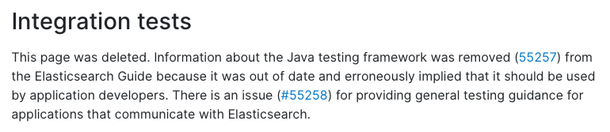
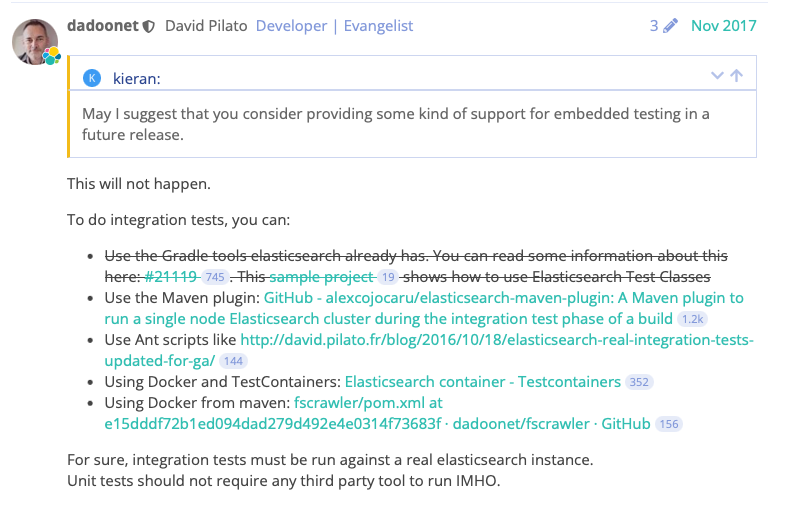

# ElasticSearch 코드 적용기 
실제로 코드의 적용은 우선은 회사의 개발망에서 토이 프로젝트로 작업했습니다  
spring boot 버전은 2.6.5 를 기준으로 작업 진행했습니다  
  

## build.gradle 을 통해서 spring-data-elasticsearch 적용

  

## elasticsearch 접속을 위한 configuration 설정

빌드 도구에 원하는걸 설정하고 나서는 직접 설정을 해주어야 합니다  
ES에 붙기 위해서 설정하는 방법은 여러가지가 있습니다  
다양한 방법 중에 가장 중요한 사항은  
RestHighLevelClient (ES와 통신하기 위해 사용하는 client 객체) 를 빈으로 등록해서 자동으로 해당 객체로 통신하도록 등록하는 것입니다  
간단하게 확인할 수 있습니다  

 
@EnableElasticsearchRepositories 을 통해서 elasticsearch 으로 접근하는 ElasticsearchRepository 의 사용을 선언

  

spring-data-elasticsearch 을 사용함으로써 정말 간편하게 사용하는 것이 가능합니다  
@EnableElasticsearchRepositories 을 통해서 기존에 사용하던 JpaRepository 처럼 ElasticsearchRepository 를 상속을 통해서 유사하게 사용합니다
 

elasticsearch 에 저장하기 위한 인덱스 객체 선언합니다(jpa 에서 Entity 역할)  
@Document(indexName = "저장하고자 하는 인덱스이름") 을 통해서 인덱스를 명시합니다  
 

@Setting, @Mapping 을 통해서 인덱스를 생성할 때 원하는 세팅 값(실제로 인덱스 생성할 떄 설정하는 값 처럼 JSON 파일이어야 합니다), 
원하는 매핑 값(실제로 인덱스의 매핑을 설정할 때 하는 값처럼 JSON 파일이어야 합니다)을 넣고 생성하는 것이 가능합니다  

추가로 jpa 에서 @Column 처럼 @Field 을 통해서 mapping 시 원하는 elasticsearch의 저장 객체 타입을 지정해두고 
@Document 이 달려있는 객체에서 @Field 을 기반으로 동적으로 인덱스를 생성하도록 구성할 수 있습니다  

+하나의 객체에서 JPA 의 entity 설정과 elasticsearch 의 document 선언을 함께 사용하고 싶다면 @Entity 와 함께 사용하는 것도 가능은 하지만  
만약에 그렇게 하게 된다면 중복으로 사용하고 싶은 객체에 대해서 각각 jpaRepository, elasticsearchRepository을 구분해서 선언해줘야 합니다  
또한 처음에 설정했던 configuration에서의 @EnableElasticsearchRepositories 에다가 elasticsearchRepository 을 상속받는 인터페이스들을 명시해주는게 필요합니다  
이렇게 elasticsearch repository 설정을 정리해주고 나서는 jpa repository 를 auto scan 해주는 부분을 추가로 설정이 필요합니다  
mainApplication 에서 @EnableJpaRepositroy 을 선언하고 해당 jpaRepository 을 상속받는 인터페이스들을 다 명시해주어야 합니다  

따라서 만약에 하나의 객체를 디비에도 적재하고 싶고 ES 에도 적재하고 싶다면 >> 별도의 데이터 베이스이기 때문에 데이터의 관리 자체도 따로 분리해서 관리하는 것이 좋다고 생각합니다  
  

## elasticsearchRepoistory 사용
기존에 jpaRepoistory 사용하는 것과 동일하다고 생각하면 좋습니다  
단순히 상속받는 인터페이스가 JpaRepoistory > ElasticsearchRepoistory 로 변경되었다고 보면 됩니다  

 
사용도 동일하게 사용함 >> save, saveAll, findBy~ 등등 jpa 에서 사용하던 것과 동일하게 사용합니다  

지정한 데이터의 등록, 수정, 삭제, 조회를 지정해주는 메소드를 통해서 사용하는 것이 가능합니다  
조회 같은 경우에는 3가지의 방법을 기반으로 해서 사용하는 것이 가능합니다  

조회1 - repository 에서 기본 제공해주는 메소드를 통해서  

 
조회2 - @Query 을 사용해서 커스텀하게 원하는 쿼리를 통해서  
native query 와 같은 경우에는 jpa에서는 실제 SQL 문을 넣었다면 ElasticsearchRepository 에서는 api 로 작성하던 쿼리를 그대로 넣어주면 됩니다

+org.springframework.data.elasticsearch.annotations.Query 를 import 받음
 

 
조회3 - queryDsl
 
사용도 동일하게 사용함 >> save, saveAll, findBy~ 등등 jpa 에서 사용하던 것과 동일하게 사용 

QueryDsl 사용  
https://www.elastic.co/guide/en/elasticsearch/reference/current/query-dsl.html

 
기존에 jpa에서 사용했던 것과 유사합니다 > 단순하게 sql 문들이 메소드로 나와있는 것 처럼 elasticsearch 의 조회 쿼리문의 메소드로 변경되어 있다는 점 정도가 차이 입니다  

  

## 테스트코드 작성 

DB를 예시로 생각해보면 테스트 시 DB를 사용하는 코드를 테스트를 방법은 크게 3가지입니다 > realDB, in-memory, embedded  
직접 데이터에 붙는 방식 같은 건 테스트코드와 디비 환경이 너무 종속적이라고 생각합니다  
테스트를 하면서 생기는 데이터에 대한 관리가 필요해지고  
디비 환경의 상태에 따라서 테스트코드가 영향을 받게 될 것이라고 생각합니다   
하여 직접 붙는 방법이 아니라 다른 방법으로 선택하고 싶었습니다  

 
테스트 방법을 찾다가 공식 문서를 확인해보니 elasticsearch로 테스트하기 위한 방법을 개발자가 가이드가 있었습니다  
(테스트 방법에 대한 가이드가 삭제되었다는 의미 > 기본적인 테스트 방법은 #55258 이슈 대화 내용에서 가이드가 있다는 의미)

  
https://www.elastic.co/guide/en/elasticsearch/reference/7.15/integration-tests.html
  

#55258번호 이슈  
  
https://discuss.elastic.co/t/in-memory-testing-with-resthighlevelclient/106196/5

위의 elasticsearch 개발자의 대답은 간단합니다  
embedded 테스트 기능을 추후 릴리즈에 추가해줄 수 있느냐 > 그럴일 없다, embededd 환경은 제공하지 않을 것이니 만약 통합 테스트가 필요하다면 이런 테스트 방법을 사용해봐라  
그러고 추천해주는 방법이 바로 Docker and TestContainer 입니다   

위 페이지에서 제공해주는게 elasticsearch 도커 이미지를 통해서 테스트 코드에서 직접 elasticsearch 을 띄워서 사용하는 방법

TestContainer? > docker 를 기반으로 junit 테스트를 할 떄 도와주는 라이브러리

TestContainer? > docker 를 기반으로 junit 테스트를 할 떄 도와주는 라이브러리입니다  
- java로 container 등록 가능
- dockerFile, docker-compose, docker-hub을 통해서 컨테이너 동작 가능
- 동작시킨 컨테이너 생명주기 관리가능
- parallel 테스트 가능
- 다양한 모듈들이 존재해서 사용성이 높음
- 단점으로는 테스트 코드의 시간이 좀 오래걸림
- 또 단점으로는 컨테이너를 테스트코드가 끝날 때 중지할 수 밖에 없어서 >> 컨테이너가 자꾸 쌓이니 싱글톤으로 가져갈 수 있도록 고려 필요 

https://java.testcontainers.org/modules/elasticsearch/  
공식 홈페이지를 보면 제공해주는게 elasticsearch 도커 이미지를 통해서 직접 elasticsearch 컨테이너 을 띄워서 사용하는 방법입니다  
코드단에서 도커 이미지를 가져와서 > 컨테이너를 실행시키고 > 테스트   

==== 위의 방법으로 바로 띄우면 nori analyzer 의 적용이 불가능 ===  
해당 건을 해결하기 위해서

testcontainer 에서 제공해주는 ElasticsearchContainer 가 아닌 그냥 GenericContainer 을 통해서 Elasicsearch 을 띄우고 + runWith 을 통해서 nori 형태분석소를 등록해주어야 합니다  

요건.. 결국 개발자 피씨에 도커가 있어야 하고.. 인터넷망이 존재해야한다는 문제가 있습니다  
인터넷망에서는 손쉽게 테스트 되었고 아주 간단하게 사용할 수 있습니다 > 오프라인 환경에서의 사용법은 못찾았습니다  
추후에 인터넷망에서 도커만 설치되어있다면 사용하기 아주 좋은 툴인 것으로 보입니다 다양한 모듈들이 존재하니 원하는대로 사용할 수 있습니다  
 

test container 가 실패하고 그 다음으로는 custom 하게 공식으로 지원하는 방법은 아니지만 개발자들이 직접 만든 embedded elasticsearch 으로 사용해보고자 했습니다   
구글링해보니 해당 팀에서 만든 라이브러리가 있었고 이걸 사용해봤습니다  
다음으로는 custom 하게 개발자들이 직접 만든 embedded elasticsearch

https://github.com/allegro/embedded-elasticsearch

보면 해당 라이브러리는 우선 사용하지 않는 것을 공식적으로 추천하고 있습니다  
elasticsearch 공식에서도 embedded 방식은 사용하지 않도록 이야기 했기 때문에 커스텀에서도 함께 경고해주는 것으로 보입니다   
현대 사용하고 있는 elasticsearch 버전과 테스트에서 사용할 버전이 다르다는 점이 있긴 하지만 우선 elasticsearch 의 버전 때문에 생기는 문제를 찾지는 못했기 떄문에 해당 방법으로
테스트를 진행하면 좋을 것이라고 생각합니다  
  

embedded-elasticsearch 라이브러리를 통해서 진행하는 방식은 아래와 같습니다  
테스트를 위해서 띄우고 싶은 엘라스틱에 대한 정보를 가지고 띄워야하는 객체 생성합니다  
테스트 시작 시, start, 종료시 stop 을 통해서 생명주기 직접 관리 필요합니다  

  
문제사항 > 경량화된 엘라스틱서치(zip파일)를 외부 넥서스로부터 다운로드 받게 되어있습니다 → 테스트를 진행하는 개발계에서는 불가능 
따로 파일을 지정해서 파일을 실행하는 방법은 일단 기본으로 해당 라이브러리에서 제공해주는 메소드에는 없었습니다  
하여 '다운로드' 하는 경로는 다행히도 지정하는 것이 가능하게 되어있기에 >> dev3에 해당 파일을 내려주는 컨트롤러를 생성해두었습니다  

결론적으로는 embedded-elasticsearch 을 통해서 아무런 작업 없이 간편하게 embedded 방식으로 테스트를 진행할 수 있습니다  

  해당 라이브러리를 사용하는 방식은 spring-data 을 사용해서 진행할 수는 없습니다... save, findby 같은 작업은 할 수 없고 직접 인덱스를 밀어넣는 부분을 처리해주고 직접 조회도 메소드를 통해서 따로 진행해야 하는, 결국은 api 단으로 사용할 수는 없을 것으로 보입니다  
아래의 코드를 기반으로해서 사용하는 것이 가능합니다  
https://github.com/allegro/embedded-elasticsearch/blob/master/es60-test/src/test/groovy/pl/allegro/tech/embeddedelasticsearch/EmbeddedElasticSpec.groovy  
하여 해당 메소드들을 라이브러리화 시켜서 테스트코드에서 사용하는 것이 가장 나은 방법으로 보입니다  

  
### 세미나 이후 개발 관련해서 확인해봐야할 사항
configuration 에 대한 고민   

테스트 코드에 대한 고민 
embedded elasticsearch 의 세미나 전의 결론은 테스트에서 직접 spring-data 메소드드을 사용할 수 없기 때문에 api 단위 테스트도 불가능, 직접 서비스로 테스트도 불가능하다는 것이 결론이였는데   
++ 그렇게 생각하고 있었는데 이게 생각해보니까 elasticsearch 와 통신하는데 주로 사용되는 RestHighLevelClinet 객체를 테스트코드에서 오버라이딩을 해주고 해주는 당시에 connection 을 맺는 부분이 있는데 이걸  
embedded 에 띄우는 elasticsearch 의 정보를 입력해서 테스트가 돌면서 실행되는 repository 를 통한 자동으로 조회하는 방식을 embedded 으로 통하도록 하는 것이 가능합니다  
그래서 시도해봤는데 >> embedded elasticsearch 을 띄우고, 기본적으로 띄운 엘라스틱서치를 GET 메소드를 통해서 조회를 하도록 되어있는데 이 조회 시 리턴값 중에 필요한 것을 받아야하는데 낮은 버전의 embedded elasticsearch(5.1.1) 에서 required 값을 내려주지 않아서 에러 발생하는 것으로 확인 했습니다  
  

그래서 우선 1차 결론은 이렇게 결정났습니다 >> 버전이 다른 케이스에서 테스트를 진행하는 것은 무리가 있고 현재 테스트를 위해서 따로 또 조회하는 개발을 하는 것은 아니라고 생각  
testcontainer 같은 경우에는 인터넷 망이 필요하기 떄문에 실제 elasticsearch 에 붙어서 진행하는 것으로 결론이 났습니다  

testcontainer 를 무조건 로컬에 도커가 있어야 하는걸까?? 하는 의문과 함께 testcontainer 내부의 설정을 바꾸는 방법에 대해서 고민해보게 되었습니다 
호스트를 개발계 서버로 돌려놓고 testcontainer 를 띄우고 죽이는걸 개발계에서 작업하는 것도 방법이라는 생각이 들었습니다  
만약에 가능하다면 편리하게 테스트코드를 작성하는 것이 가능하기도 하며 해당 테스트 코드를 돌리고자 하는 개발자의 PC 에 도커가 없어도 해당 테스트 코드를 실행할 수 있을 것 이라고 예상하고 테스트를 해볼 생각입니다 
  

Transaction 에 대한 고민  
Elasticsearch 에서의 @Transaction 에 대한 정보 - 트랜잭션 범위, 롤백 범위에 대한 고민  
Elasticsearch 에서의 @Lock 에 대한 정보  
 

### 피드백에 대한 리서치 내용
#### Elasticsearch 에서 transaction 에 대한 고민
 

**Elasticsearch 에서는  지원하지 않습니다**  
stackoverflow 으로부터의 답변 : https://stackoverflow.com/questions/68957591/does-elastic-search-support-acid-properties  
 

공식 블로그  

 

그래서 정말 필수적으로 필요했던 RDBMS와 함꼐해서 사용하는 것을 공식 블로그에서도 추천해주고 있습니다  

 

데이터를 ACID 하게 트랜잭션을 관리할 필요가 있는 경우에는 RDBMS와 함께 사용하는게 필요합니다 > CQRS 형식의 프로젝트 구성하면 좋을 것이라고 생각합니다  

단일로 document을 보장하기 위해서 Elasticsearch 에서 제공하는 방법은 document 별로 versioning 을 제공한다는 것입니다  
버저닝으로 버전이 다른 케이스에서는 optimistic locking exception 을 통해서 버전이 다른 케이스에는 데이터가 수정되지 못하도록 막고 있습니다  
또한 문서를 조회할 때 api에 query param 값을 통해서 버전별로 해당 문서의 상태를 조회하는 것 또한 가능합니다  
   

#### Elasticsearch 의 configuration 을 구성하는데 있어서 고민  
직접 config 을 구현해서만 사용해야 하는건가?? >> X  
결론적으로 확인해봤을 때 스프링에서 지원하는 것이니 만큼 단순한게 application.properties 에서 설정해 주는 것으로 어렵지 않게 설정들을 해주는 것이 가능했습니다  
다만 인증서관련해서 작업하는 것은 공식적으로 application-properties 을 통해서 설정하는 것은 없는 것으로 확인했습니다  
내부적으로 커스텀하게 config 설정하는 것이 필요한 경우에는 따로 기존에 구현했던 방식대로 구현이 필요합니다  
    

#### 테스트 코드에 대한 고민  
embedded > 버전으로 차이로 인한 잠정적 이슈사항을 고려하기 어려우니 포기  
test container > 무조건 로컬에서만 할 수 있을까? > 테스트 전용으로 진행하는 사항들을 dev1 docker 를 바라보게 해보자  
우선 진행하는데 .testcontainer.properties 를 해당 테스트 코드를 돌리는 컴퓨터의 루트 디렉토리에서 설정해주어야 합니다  
거기서 Environment 뭐시키 strategy 를 설정해줘서 직접 내가 원하는 도커 호스트로 돌리는 방법이 가능한데 이 방식을 사용해서 dev1 서버로 돌려봤는데   
dev1 에 떠져있는 도커에서 아웃바운드를 설정해줘야 했습니다..  
그래서 dev1 도커에서 도커 설정을 통해서 2375(default) 포트를 통해서 외부에서 해당 포트로 접근할 수 있도록 설정해주고, 진행하니까 이제는 docker client api, docker server api 의 버전이 맞지 않는다고 에러를 뱉는 중입니다  

          

