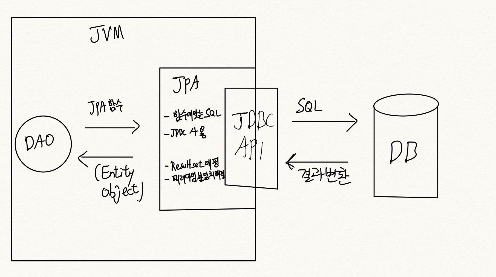

# JPA 책

자바 ORM 표준 JPA 프로그래밍 책을 구매해서 공부를 기록하는 곳

JPA가 중요하다는 생각이 들어서 이번에 구매해서 공부중

#### 책을 정독하며 기록을 통해서 한 번 더 되새기고 언제든 찾아볼 수 있도록 기록..!

모든 출처는 자바 ORM 표준 JPA 프로그래밍 책과 본인 뇌

## Day1 - JPA의 소개

### ORM이란?

ORM : Object Relational Mapping의 줄인말로 객체와 관계형 데이터베이스 사이의 차이점을 해결해주는 프레임워크

JPA : Java Persistence API로 위에서 언급한 자바 진영에서 사용하는 ORM 표준 기술

JPA는 반복적인 CRUD SQL을 알아서 처리해주고 객체 모델링과 관계형 데이터베이스 사이의 차이점도 해결해준다.

JPA는 실행하는 시점에 SQL을 만들어서 실행한다.

자바로 만든 애플리케이션은 JDBC(자바에서 데이터베이스에 접속할 수 있도록 하는 자바 API)를 사용해서 SQL을 데이터베이스에 전달하는 방식을 통해서 데이터베이스를 활용한다.

하지만 관계형 데이터베이스와 객체지향 프로그래밍은 패러다임이 다르다. 객체를 데이터베이스에 저장할 수는 없고 데이터베이스에는 데이터 중심으로 구조화되어 있기도 하며 객체지향적으로 생각하기에는 쉽지 않다. 그렇기 때문에 이러한 문제들을 해결해야 하는 문제가 남아있다.

이러한 방식으로 객체레벨에서 db를 조회하고 이어져 나오는 방식이다.

ORM 프레임워크는 객체와 테이블을 매핑해서 패러다임의 불일치 문제를 개발자 대신 해결해준다. 따라서 사용하는 사람 입장에서는 객체 측면에서 더욱 정교한 객체 모델링이 가능하고 관계형 데이터베이스는 데이터베이스에 맞도록 모델링하면 된다. 그리고 이 2개를 매핑해야 하는 방법만을 명시하면 된다.

그리고 ORM 프레임워크에는 여러가지 종류가 존재하는데, 가장 많이 흔하게 사용하는건 Hibernate 프레임워크를 가장 많이 사용한다.

### JPA란?

자바 ORM 기술에 대한 API 표준 명세

\= 여러가지 인터페이스를 모아둔 것

따라서 이것을 사용하기 위해서는 JPA를 구현한 ORM 프레임워크를 선택해야하고 결국은 JPA를 구현한 구현체를 사용하게 된다. 그리고 그 구현체의 대표로는 Hibernate가 존재한다고 볼 수 있다.

그래서 스프링 데이터 jpa에서는 genericDao라는 커스텀 구현체를 제공해준다. 이것은 메소드의 명칭으로 쿼리를 생성할 수 있다.

왜 이걸 사용하는가?

1. 생산성 : JPA를 사용하면 기존에 자바에서 사용하던 것 처럼 어렵지 않게 db에 접근하며 사용할 수 있다. 그리고 반복적인 crud와 같은 sql을 직접 작성하지 않음 그래서 데이터베이스 설계를 데이터 중심이 아니라 객체 중심으로 변경하는 것이 가능해짐
2. 유지보수 : 엔티티에 필드가 추가된다고 가정해보았을때 과거에는 이에 관련된 crud와 같은 JDBC API를 모두 수정해줘야했지만 이제는 그런 JDBC API코드를 JPA가 알아서 처리해주기 때문에 유지보수가 쉬워짐
3. 패러다임의 불일치 해결
4. 성능 : JPA는 애플리케이션과 db에서 동작하기 때문에 성능적인 면에서 최적화를 시도해볼만 하다.
5. 데이터 접근 추상화와 벤더 독립성 : 애플리케이션은 결국 처음에 선택한 데이터베이스에 종속되기 마련이다. 하지만 JPA는 애플케이션과 데이터베이스의 사이에서 추상화된 접근계층을 제공하고 있기 때문에 특정 데이터베이스에 종속되지 않는것이 장점이다 -> 그래서 배달대행사 연동 테스트 페이지 프로젝트 같은 경우에도 로컬에서는 h2를 사용해서 로컬로 구성해서 잘되는지 확인했고 서버에 올리고 나서는 오라클을 사용해서 디비를 사용한다. 이러한 것이 JPA를 사용한 것의 장점이다.

JPA라는 표준 덕분에 특정 구현 기술에 대한 의존도를 줄일 수 있고 다른 구현 기술로 손쉽게 이동할 수 있다는 장점이 있음.

\
\
\
\
\
\
\
\
\
\
