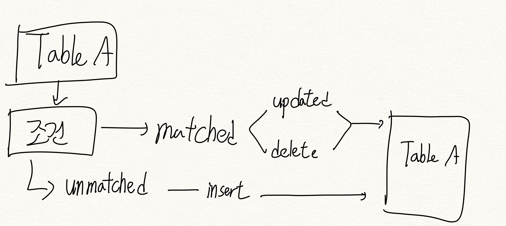

# 오라클 기본 - 기본 내용 정리

오라클에서의 기본 문법, 조인 등 오라클 DB 관련해서 기본적인 내용을 정리해보려고 한다 <br>
<br><br>

## 데이터의 다양한 타입

기본적으로 테이블을 생성할 때, 테이블에 들어가는 칼럼에 대해서 **데이터타입**과 **사이즈**를 지정하고 데이터타입에는 다양한 종류가 존재 <br>
<br>

#### 숫자형 데이터타입

숫자열 데이터 타입은 <br>
**NUMBER(p, s)** <br>
이고 p = 전체 자리수이고 최대 38까지 설정 가능, s = 소수점 이하 자릿수 또는 유효 숫자이고 -84 ~ 127까지의 범위를 가지고 있다 <br><br>
NUMBER 데이터 타입은 정수 또는 실수의 숫자형 데이터를 저장하기 위해 사용한다 <br>
NUMBER(p) 이렇게 작성하게 되면 **정수만 저장**이 되고 <br>
NUMBER(6, 2) 이렇게 작성하게 되면 전체 자리수가 6자리에 정수자리는 4자리, 소숫점 자리는 2자리 이렇게 생각하면 된다 <br>
<br><br>

예시를 봐보자 <br>
실수를 저장하는 경우, NUMBER(6,2) 이렇게 설정해두고 <br>
1234.56 -> 정상적으로 1234.56이 저장됨 <br>
1234.567 -> 소숫점은 2자리로 제한되어있기 때문에 **반올림**되서 1234.57이 저장됨 <br>
12345.6 -> 소숫점은 2자리를 채워야 하지만 **채우지 않았기 때문에 오류** 발생 <br>
<br>
정수를 저장하는 경우, NUMBER(3) 이렇게 설정해두고 <br>
123 -> 정상적으로 123이 저장 <br>
123.4 -> 하나의 자릿수는 **반올림**되어 123이 저장 <br>
1234 -> **자릿수가 맞기 않기 떄문에 오류** 발생 <br>
<br>
실수든 정수든 저장하는 경우, NUMBER 라고만 설정했을 때는 최대자릿수인 38까지 그대로 저장된다 <br>
<br><br>

#### 문자형 데이터타입

문자형 데이터타입은 크게 CHAR(s), NCHAR(s), VARCHAR2(s), NVARCHAR2(s) 이러한 종류가 있다 <br>
모든 데이터타입에 들어가는 파라미터 (s)는 문자열의 자릿수를 의미하고 여기 들어갈 수 있는 최대 길이는 2000 bytes임 <br>
가장 유명한 2가지를 알아보자 <br>
<br>
우선 CHAR라는 데이터타입은 **고정길이 문자열을 저장**할 떄 사용되고, 최대 2000 바이트까지 가능하다 <br>
고정길이 문자열이라고 함은 만약 10개로 지정해두고 test를 집어넣으면 왼쪽부터 test를 집어넣고 **나머지는 공백으로 저장** <br>
만약 해당 긻이보다 더 긴 문자열을 집어넣으려고 하면 에러난다 <br>
<br>
다음으로는 VARCHAR2 이다 문자열을 지정하는데 있어서 가장 많이 사용되는 데이터 타입이고 **가변길이 문자열을 저장할 때 사용한다** <br>
가변길이 문자열이라는 이름답게 입력한 데이터에 따라 저장되는 자릿수가 변하게 된다 <br>
항상 어떤 데이터가 들어올지 모르기 때문에 데이터 효율성을 생각해서도 varchar2를 사용하자 <br>
<br><br>

#### 날자형 데이터타입

날짜형 데이터타입으로는 DATE, TIMESTAMP, INTERVAL이 존재한다 <br>
<br>

첫 번째로 DATE 타입은 고정된 7 바이트를 할당하며 크기는 따로 지정하지 않는다 <br>
DATE은 날짜 + 시간 을 저장하기 위해서 사용하고 오라클 사용환경에 따라 다르지만 코리안 기준으로는 <br>
'YY/MM/DD HH24:MI' 이런 형식이다 <br>
<br><br>

두 번째는 TIMESTAMP 데이터 타입이고 DATE 의 확장판이라고 생각하면 편하다 <br>
그래서 TIMESTAMP 에는 원하면 자릿수를 최소(생략) 6자리부터 9자리까지 지정하는 것이 가능하다 <br>
데이터 타입을 비교해서 확인해보면 <br>

현재를 기준으로 <br>
DATE : 22/03/19 <br>
TIMESTAMP : 22/03/19 12:44:34.000000000 <br>
TIMESTAMP WITH TIME ZONE : 22/03/19 12:44:34.000000000 ASIA/SEOUL <br>
TIMESTAMP WITH LOCAL TIME ZONE : 22/03/19 12:44:34.000000000 <br>
<br>

세 번째는 INTERVAL 타입이고 여기에는 <br>
INTERVAL YEAR TO MONTH, INTERVAL DAY TO SECOND 데이터 타입이 존재한다 <br><br>

- INTERVAL YEAR (y) TO MONTH (m) : y은 연, m은 개월수의 자릿수이고 기본값은 2로 지정되어있음
- INTERVAL DAY (d) TO SECOND (s) : d는 일의 자릿수로 기본값은 2, s는 초의 자릿수로 기본값은 6
  <br><br><br>

#### BLOB, LOB

BLOB(Binary Large OBject) : 이진 파일로 표현되는 정보를 의미하고 우리가 아는 데이터로는 그래픽, 오디오, 동영상과 같은 멀티미디어 정보이다 <br>
특징으로는 하나의 테이블에 한 컬럼만 사용할 수 있으며 이진 파일을 위한 RAW, LONG RAW, LONG 타입이 존재한다 <br>
<br>
LOB(Large OBject) : LOB란 2GB를 초과하는 큰 대용량의 데이터를 저장하기 위해서 존재하는 타입이고 이 것은 크기를 지정하지 않고 가변길이로 저장됨 <br>
세부 타입들은 이렇게 존재함 <br>

- BLOB : 구조화되지 않은 이진 파일을 저장하며 최대 4GB까지 저장
- CLOB : 구조화되지 않은 문자 데이터를 저장하며 최대 4GB까지 저장
- NCLOB : 저장된 문자열에 대해 다양한 언어를 지원하고 문자열을 저장하기도하며 최대 4GB까지 저장
- BFILE : 구조화되지 않은 이진 파일을 디비 외부에 저장하고 최대 4GB까지 저장
  <br><br>

## 오라클 디비에서의 제한

- 하나의 테이블에서 넣을 수 있는 최대 컬럼수는 1000개이고 테이블과 열에 대한 insert는 제한이 없다]
- 하나의 컬럼의 최대 길이는 4000 바이트, 숫자의 최대 길이는 38, 날짜의 사용 범위는 BC 4712/1/1 ~ AD 9999/12/31
- 한 행의 최대 길이는 4000000000바이트, 서브 쿼리의 하위 단계는 255개, 사용자정의명의 최대 문자수는 30바이트이다
  <br><br><br>

## 오라클 디비에서의 데이터 무결성

데이터 무결성이란 <br>
모든 개체는 그 객체에 있는 각 행을 유일하게 식별하는 속성을 가져야 하고 테이블에서 중복된 행을 존재할 수 없다 <br>
이것이 데이터 무결성이고 오라클에서는 테이블에 대해서 기본키, 외부키, 고유키, Null/NOT Null, check 이렇게 5 가지의 제약조건을 제공해준다 <br>
<br>

#### 기본키 제약조건

기본키란 개체의 인스턴스를 유일하게 정의하는 속성이다. 유일하기 떄문에 중복된 데이터를 허용하지 않고, 널 값을 허용하지 않는다는 점을 기억 <br>
<br>

#### 외부키 제약조건

외부키는 하나 이상의 컬럼이 다른 테이블과의 기본 키와 관계를 정의하는 컬럼이고 이것으로 인해서 참조 무결성을 보장한다 <br>
참조 무결성이란 외부키의 컬럼에 값이 입력될 때 관계가 정의된 참조하는 테이블의 기본 키가 존재하지 않으면 이 값이 거부되는 것이다 <br>
<br>

#### Null, NOT Null 제약조건

이건 컬럼에 null값을 허용하는지 허용하지 않는지에 대한 의미이다 <br>
<br>

#### 고유키 제약조건

컬럼에 입력되는 값이 고유한 값을 요구하는 것으로 고유 키가 지정된 컬럼에는 중복된 데이터가 들어갈 수 없다 <br>
<br>

#### 체크 제약 조건

이건 각 칼럼에 대한 입력 값의 범위나 조건을 지정할 때 사용되고 입력하는 컬럼의 값이 입력하고 있는 다른 컬럼의 값을 참조할 때 체크 제약조건을 지정할 수 있음 <br>
<br><br><br>

# 테이블 설계

테이블의 정의는 DDL(Data Definition Language)를 사용하고 그 종류로는 CREATE, ALTER, DROP 이 있다 <br>

## CREATE

테이블을 생성하는데는 CREATE 이라는 예약어를 사용하고 <br>

```sql
CREATE 테이블이름 (
    컬럼 데이터타입 [NOT NULL],
    컬럼N 데이터타입 [NOT NULL],
    [CONSTRAINT 제약조건명명 PRIMARY KEY (컬럼1, 컬럼2)],
    [CONSTRAINT 제약조건명명 FOREIGN KEY (컬럼1, 컬럼2)
        REFERENCES 참조테이블이름 (컬럼1, 컬럼2)
    ]
);
```

해당 테이블을 구성할 컬럼과 데이터타입 그리고 nullable을 처리해준다 추가적으로 UNIQUE을 걸거나 CHECK 제약조건을 컬럼에 걸어서 insert값에 대한 제약조건을 걸거나 DEFAULT키워드를 사용해서 값이 안들어왔을 때 기본값을 설정해 줄 수 있음<br>
그리고 constraint을 통해서 pk나 fk를 설정해준다 <br>
fk는 일단 테이블간의 관계를 정의할때 사용되며 관계를 정의하는 생성할 테이블의 하나 이상의 칼럼이 외부 키가 되고, 이 외부 키는 참조할 테이블의 pk과 관계가 성립 <br>
<br>
외부키와 기본키와의 관계는 <br>

- 생성할 테이블의 관계를 정의하는 컬럼이 외부 키가 됨
- 참조하는 테이블의 기본 키와 관계가 성립된
- 외부 키 컬럼의 수와 참조하는 테이블의 기본 키 컬럼의 수가 동일해야함
- 외부 키 컬럼의 데이터타입과 참조하는 테이블의 기본 키 컬럼의 데이터 타입과 동일해야함
- 외부 키 컬럼의 데이터타입을 생략하면 참조하는 테이블의 기본 키 컬럼의 데이터타입을 참조
- 테이블 생성 시, 참조할 테이블의 기본 키 컬럼은 생략할 수 있음
  <br><br>

**테이블을 생성하는 것 뿐만이라 테이블을 복사해주는 것도 가능하다** <br>
오라클에서 테이블의 구조를 복사하고 싶을 땐 <br>
(단일 테이블만! 만약 제약조건까지 변경하고 싶다면 제약조건이 같이 걸려있는 모든 테이블을 다 복사 다시해야함) <br>
CREATE TABLE 테이블명 AS SELECT * FROM 변경하려는테이블명 WHERE 1=2;<br>
<br><br><br>

## ALTER

테이블을 생성하고 난 뒤에는 ALTER를 통해서 테이블을 조작하는 것이 가능하다 <br>
ALTER를 해주면 내부에 들어가있는 데이터인 '열'에 해당하는 데이터들은 그대로 존재하고 테이블의 구조만 변경된다 <br>
변경할 수 있는 것들은 이런게 있다 <br>

- 기존 테이블에 새로운 컬럼 추가
  - ALTER TABLE 테이블명 ADD(컬럼명 데이터타입 [추가속성], 컬럼명2 데이터타입 [추가속성]...)
- 기존 테이블에 컬럼의 크기를 늘리거나 줄이기
  - ALTER TABLE 테이블명 MODIFY (컬럼명 데이터타입(바꾸고싶은 크기))
- 기존 컬럼에 Null을 Not Null으로, Not Null을 Null로 제약조건 변경
  - ALTER TABLE 테이블명 MODIFY (컬럼명 데이터타입 [NOT NULL/NULL])
- 기존 컬럼 삭제
  - ALTER TABLE 테이블명 DROP COLUMN 컬럼명
- 기존 컬럼에 기본 값 지정
  - ALTER TABLE 테이블명 ADD PRIMARY KEY(조합할 컬럼, 조합할 컬럼)
  - 삭제는 단순하게 ALTER TABLE 테이블 DROP PRIMARY KEY
- 기존 컬럼에 다른 제약조건 지정 또는 삭제
  - 외래키의 추가는 ALTER TABLE 테이블 ADD CONSTRAINT fk이름 FOREIGN KEY 외부테이블pk이름 REFERENCES 외부테
  - 외래키의 삭제는 조건없이 ALTER TABLE 테이블 DROP CONSTRAINT fk이름
    <br><br><br>

## DROP

테이블을 삭제하는건 복잡하지 않게 <br>
DROP TABLE 테이블명 <br>
이렇게 삭제할 수 있는데, 만약에 해당 테이블에 연결되어 있는 외부키가 없을 때이다 즉, 다른 테이블에서 삭제하려는 테이블을 외래키로 참조하고 있으면 삭제할 수 없다는 것 <br>
<br><br><br><br>

# 데이터베이스 검색

DML(Data Manipulation Language)라는 데이터 조작어를 사용해서 진행한다 <br>
크게 5가지 종류가 있음

- SELECT : 행 검색
- INSERT : 행 삽입
- UPDATE : 행 수정
- DELETE : 행 삭제
- MERGE : 두 개 이상의 테이블 데이터를 하나의 테이블로 병합

<br><br><br>

## SELECT

SELECT는 테이블에게 필요한 데이터를 질의(query)해서 검색하는 명령어이다 <br>
문법으로는 SELECT [DISTINCT] 컬럼 FROM 테이블 <br>
이 명령어는 select와 from 이 2 가지 예약어가 필수로 들어가야 한다 <br>
select의 특징이라고 하면

- from 절의 테이블으로부터 검색하여 출력할 컬럼명이나 *(와일드카드)를 사용해서 기술하고 여러 가지의 컬럼을 입력할 때는 ,을 사용
- 컬럼 앞에는 distinct이라는 예약어를 통해서 컬럼중에서 겹치는게 없이 나오게 할 수 있다
- 컬럼 뒤에는 한 칸 이상의 공백을 두고 as을 통해서 별명을 주는 것이 가능하다
- 계산식이나 함수 등을 사용할 수 있음

<br><br>
SELECT문의 각 절에는 무엇이 들어갈까 <br>

- SELECT : 컬럼명, *, 함수, 수식 등이 들어갈 수 있음
  - 출력할 컬럼명 등을 넣고 최종 결과 테이블을 생성
- FROM : 테이블명, 뷰명등이 들어갈 수 있음
  - 검색할 테이블을 적으면 된다
- WHERE : 검색조건을 적으면 된다
  - 조건을 작성하는데 있어서 산술연산자(+,-,*,/)가 들어갈 수 있고 관계연산자(>,>=,<,<=,=,<>,!=)도 들어갈 수 있으며 논리연산자(AND, OR, NOT)가 들어갈 수 있음
  - 연결연산자로 '||' 을 지원해주는데 이건 리눅스의 파이프라인과 비슷하게 문자를 잇고 싶을 때 사이에 ||을 넣어줄 수 있다
  - LIKE 연산자가 있는데 요놈은 문자열의 내부에서 '포함'하는지를 확인하는 과정이고 검색하고 싶은 문자열의 앞뒤에 %을 넣어서 나머지 처리를 할 수 있다 / NOT LIKE도 있음
  - IN 연산자는 가능한 값들의 목록을 입력해주고 해당 목록과 비교하여 만약 제시한 목록에 있는 값이 실제 데이터에도 존재한다면 true를 뱉는 방식이다
  - BETWEEN ~ AND 연산자는 지정된 범위의 최소값부터 최대값까지의 범위를 계산하는 연산자이고 그 대상으로는 **숫자, 문자, 날짜** 모두 가능하다
- GROUP BY : 컬럼명을 묶어서 조회하는 방식
- HAVING : 검색조건을 넣어주고 where와 다른점은 group by의 검색조건에 해당하는 값이다
- ORDER BY : 컬럼을 적고 그 뒤에는 ASC/DESC을 적어서 정렬하는 방식을 정하면 된다
  <br><br><br>

### 서브쿼리

서브 쿼리란 SQL 명령문을 사용하는데 그 내부에서 한번 더 SELECT 하는 방식이다 <br>
SQL 명령문 내부에 서브 쿼리가 존재한다면 일단 서브 쿼리를 먼저 실행해서 그 결과 값을 메인 쿼리로 보내고 그 결과를 사용해서 쿼리를 진행한다 <br>
<br>
주의사항

- 서브 쿼리는 괄호()안에서 작성
- 서브 쿼리가 뱉는 행의 수는 연산자가 기대하는 값의 수와 같아야하며 서브쿼리에서 뱉는 컬럼의 수는 기대하는 컬럼의 수와 같아야함
- 서브 쿼리에서는 order by를 사용하지 않음
- 메인 쿼리의 from 절에 있는 테이블의 컬럼명은 서브 쿼리 내에서 사용할 수 있지만 서브 쿼리의 from에 있는 테이블 컬럼명을 메인 쿼리에서는 사용 불가능
- 서브 쿼리는 최대 255개까지 가능

<br><br><br>

#### 단일 행 서브 쿼리

말 그대로 서브 쿼리의 결과 값이 단일 행이고 단일 컬럼이나 다중 컬럼으로 뱉는 쿼리이다 <br>
책의 실습을 한번 보자 <br>
SG_Score테이블의 'L1031' 'SQL' 과목의 행들을 출력하고 'L1031' 과목의 평균 점수보다 높은 점수를 출력하라

```sql
SELECT * FROM SG_Score
  WHERE Course_ID = 'L1031' 
    AND Score >= ( SELECT avg(Score) FROM SG_Score WHERE Course_ID='L1031');
```

이 쿼리문에서는 일단 L1031에 대한 평균점수를 알아야 where절에 조건으로 넣어주는데 이것을 굳이 쿼리문 2개로 나눠서 평균을 먼저 구하고 <br>
그 결과를 가지고 값을 집어넣어서 조회하는 것이 아니라 서브 쿼리를 사용해서 내부에서 먼저 구해와서 그것으로 또 쿼리에 사용하는 방식이다 <br>
<br><br>

#### 다중 행 서브 쿼리

이 서브 쿼리를 사용하게 되면 다중 행으로 반환되고 다중 행 연산자로는 ANY, SOME, ALL, EXISTS 가 있음 <br>

- IN : 메인 쿼리의 비교 조건이 서브 쿼리의 결과 중에서 하나라도 일치하면 참을 뱉는 연산자
- ANY, SOME : 메인 쿼리의 비교 조건이 서브 쿼리의 결과 중에 하나 이상 일치하면 참을 뱉는 연산자
- ALL : 메인 쿼리의 비교 저건이 서브 쿼리의 결과와 모든 값이 일치하면 참을 뱉는 연산자
- EXISTS : 메인 쿼리의 비교 조건이 서브 쿼리의 결과 중에서 하나라도 반환하면 참을 뱉는 연산자
  <br><br>

#### 서브 쿼리를 이용한 테이블 생성

서브 쿼리에서 CREATE TABLE문을 통해서 테이블의 데이터를 전체 혹은 일부분을 복사해서 새로운 테이블을 만들 수 있다 <br>
일단은 뭐 알고나 있자 <br>
<br><br><br>

## INSERT

insert문을 한 번 실행할 때마다 한 행에 데이터가 저장된다. 그래도 이것의 사용은 이렇게 한다<br>
INSERT INTO 테이블[(컬럼, 컬럼2, ...)] VALUES (값, 값 ...); <br>
주의사항은 이러하다 <br>

- 컬럼명과 입력하는 값의 수와 데이터타입은 반드시 동일해야 함
- 기본 키와 NotNull으로 설정되어 있는 컬럼은 반드시 넣어줘야 한다
- 컬럼명이 생략되면 테이블에 존재하는 모든 컬럼을 작성해줘야 한다
- 입력하지 않은 컬럼의 값은 기본적으로는 null이 들어가지만 default값이 있으면 default값이 들어감
  <br><br>

만약 insert 시, 오류가 발생하면 이하의 항목들을 확인해보자

- 컬럼명과 입력하는 값의 수가 동일하지 않을 때
- 컬럼명과 데이터 타입이 동일하지 않을 때
- 기본 키와 not null컬럼의 값이 입력되지 않았을 때
- 기본키가 중복된 데이터나 null값을 입력할 때
- 외부 키 컬럼의 값이 차조하는 테이블의 기본 키 값이 아닐 때
- 고유 키 제약조건이 지정 컬럼에 중복된 데이터가 들어갈 때
- 입력 값이 컬럼의 크기를 초과할 때
  <br><br>

#### 서브쿼 리가 있는 INSERT 문

서브 쿼리가 있는 insert문은 기존 테이블의 모든 데이터 또는 일부분을 다른 테이블에 동일하게 복사하는 경우에 유용하다 <br>
주의사항으로는

- insert 문의 컬럼 수와 select 절의 컬럼 수가 반드시 동일
- insert 문의 컬럼과 select 절의 컬럼의 데이터 타입은 반드시 동일
- select 절에 기술된 컬럼이 insert에 기술된 컬럼의 순서대로 값에 저장

<br><br><br>

## UPDATE

이것은 테이블에 저장된 각 행들의 컬럼들을 변경하는데 사용 <br>
UPDATE 테이블 SET 컬럼=바꿀값 [WHERE 조건]; <br>
<br><br><br>

## DELETE

테이블에 저장된 각 행을 삭제하는 방법이고 단일로도 삭제 가능하고 전체 행을 삭제하는 것도 가능 <br>
DELETE FROM 테이블 [WHERE 조건]; <br>
만약 WHERE절을 따로 언급해주지 않는다면 **모든 행을 삭제**하고 WHERE절이 있다면 해당 절에 만족하는 행만 삭제함 <br>
<br>
이외에도 TRUNCATE TABLE을 사용해서 테이블에 존재하는 모든 행을 삭제할 수 있다 테이블을 싹 비우는데에는 DELETE보다는 좋지만 <br>
TRUNCATE을 통해서 삭제된 행(데이터)들은 복구될 수 없다는 단점이 존재한다 <br>
<br><br><br>

## MERGE

MERGE문은 테이블의 구조가 동일한 두 개 이상의 테이블이나 뷰, 서브 쿼리로부터 데이터를 비교하여 하나의 데이터를 병합하는 방식으로, 오라클에서만 제공해주는 명령어다 <br>
이 명령어는 결국 입력과 수정을 동시에 작업할 수 있는 명령어이다 <br>

```sql
MERGE INTO 테이블A
  USING [ 테이블 B | 뷰 | 서브쿼리 ]
  ON [ 조건 ]
  WHEN MATCHED THEN UPDATE SET ...
  WHEN NOT MATCHED THEN INSERT INTO .... VALUES ...;
```

- 테이블A : 대상 테이블명
- USING : 원본 테이블이나 뷰 또는 서브 쿼리를 적음
- 조건 : 원본 테이블이나 대상 테이블에 대한 조건을 비교하여 만족하면 UPDATE/DELETE, 만족하지 않으면 INSERT
- WHEN MATCHED : 조건이 만족하는 경우 실행할 UPDATE문이나 DELETE문을 작성
- WHEN NOT MATCHED : 조건이 만족하지 않을 경우 실행할 INSERT문을 작성

 <br>
예시를 보자 <br>
Course_Temp 테이블에 새로 개설된 과목과 변경된 과목을 이용하여 Course 테이블에 병합하라

```sql
MERGE INTO Course C
      USING Course_Temp T
      ON ( C.Course_ID = T.Course_ID )
WHEN MATCHED THEN
      UPDATE
      SET C.Title = T.Title, C.Course_Fees = T.Course_Fees
WHEN NOT MATCHED THEN
      INSERT
      ( Course_ID, Title, C_Number, Professor_ID, Course_Fees) 
      VALUES
      ( T.Course_ID, T.Title, T.C_Number, T.Professor_ID, T.Course_Fees);  
```

일단은 이렇게 사용한다~ 라고 알아두고 실제로 사용할 때 보충해서 적어두자 <br>
<br><br><br>

## 트랜잭션 제어 명령

오라클 디비에서는 데이터 변경 작업이 즉각적으로 반영되지 않는다 시간을 두고 변경 작업을 디비에 적용하는데, <br>
이를 관리하는 단위가 트랜잭션이다 <br>
트랜잭션이란 테이블에 대해서 행을 추가하거나 컬럼 값 수정 또는 행의 삭제에 의해서 변경되는 작업의 단위 / 변경작업을 할 수 있도록 사용자에게 할당된 기간 <br>
여기서 나오는 명령어는 2개가 있다 <br>

- COMMIT : 테이블에 대한 트랜잭션 영역의 변경 작업을 영구히 저장
- ROLLBACK : 테이블에 대한 트랜잭션 영억의 변경 작업을 삭제
  <br><br><br>

# SQL 함수

SQL 에는 데이터 조작을 위한 다양한 SQL 함수를 제공하고 있다

그 종류로는 크게 단일행 함수가 있고 복수행 함수가 있다

단일행 함수(문자, 숫자, 날짜, 데이터변환 등) : 행의 수만큼 반환, SELECT-WHERE-GROUPBY, 인수가 사용, SQL함수가 많음

복수행 함수(변환, 분석) : 그룹에 대하여 하나의 값만 반환, SELECT-HAVING, GROUPBY절에 그룹화
<br><br>

## 문자형 함수

- LOWER(str) : 소문자로 변환
- UPPER(str) : 대문자로 변환
- INITCAP(str) : 단어의 첫 문자만 대문자로 변환
- LENGTH(str) : 문자열의 길이 계산
- LENGTHB(str) : 문자열의 길이를 바이트로 계산
- INSTR(str, c, p, n) : 특정 문자의 위치 계산
- SUBSTR(str, p, n) : 해당 위치에서 특정 문자열을 추출
- CONCAT(str1, str2) : str1과 str2를 결합
- TRIM(str, 'set') : 문자열에서 특정 문자 제거
- PAD(str, n, 'set') : 문자열에 특정 문자 추가
- REPLACE(str, 'c1', 'c2') : 문자열의 일부분을 다른 문자열로 대치
  <br><br>

## 숫자형 함수

- ROUND(M, N) : M 값을 소숫점 N 자릿수로 반올림하여 실수로 리턴
- TRUNC(M, N) : M 값을 소숫점 N 자릿수로 내림하여 실수로 리턴
- CEIL(M) : M 값의 소숫점 이하를 올림하여 정수로 리턴
- FLOOR(M) : M 값의 소숫점 이하를 내림하여 정수로 리턴
- MOD(M1, M2) : M1을 M2로 나눈 나머지 값을 리턴
  <br><br>

## 날짜형 함수

- CURRENT_DATE : 지역 시간대의 현재 날짜를 리턴
- CURRENT_TIMESTAMP : 지역 시간대의 현재 날짜와 시간을 리턴
- SYSDATE : 시스템의 현재 날짜와 시간을 리턴
- ADD_MONTHS(d, n) : 날짜(d)에 n개월 수를 더해서 리턴
- MONTHS_BETWEEN(d1, d2) : 두 날짜 d1, d2의 월차를 계산해서 리턴
- LAST_DAY(d) : 그 달(d)의 마지막 날짜를 리턴
- NEXT_DAY(d, '요일') : 날짜(d)로부터 다음에 나오는 요일을 반환
- ROUND(d) : 날짜(d)를 반올림
- TRUNC(D) : 날짜(d)를 내림
  <br><br><br>

## 데이터 변환함수

#### 날짜형으로 변환하는 TO_DATE()

날짜형 데이터의 기본은 YY/MM/DD 인데, 우리가 원하는 데이터 형식은 제각각이기 때문에

TO_DATE(문자형 데이터, '날짜형 변환형식')로 사용하고

가장 풀로 사용하는건 'YYYY-MM-DD HH24:MI:SS' 이 형식에서 수정하고 더 찾아서 사용하자<br>

<br><br>

#### 문자형으로 변환하는 TO_CHAR()

이건 숫자나 날짜를 문자로 변환하는 케이스이다

TO_CHAR(날짜형 데이터, '날짜형 변환형식') 이렇게 사용

추가로 TO_CHAR(숫자형 데이터, '숫자형 변환형식') 이렇게 숫자형 데이터를 문자형 데이터로 수정하는 것이 가능하다

#### 숫자형으로 변환하는 TO_NUMBER()

이건 문자열 데이터를 숫자형 데이터로 수정하는 방식이다

## NULL 관련 함수

- NVL(expr, '값') : expr가 null이면 값을 리턴
- NVL2(expr, '값1', '값2') : expr가 null이면 값1, not null이면 값2 리턴
- NULLIF(expr1, expr2) : expr1==expr2 ? null : expr1
- LANVL(조건) : 조건이 참이면 거짓을 리턴, 거짓이면 참 리턴
- COALESCE(expr1, expr2, expr3, ...) : expr1이 null이 아니면 expr1을 리턴, null이면 expr2이 null인지 비교해서 쭉쭉 뒤로 나감

## 기타 함수

#### DECODE(expr, 비교값1, 리턴값1, 비교값2, 리턴값2, 비교값N, 리턴값N) : expr이 비교값이면 리턴값을 리턴

#### CASE-WHEN

```sql
CASE WHEN 조건식1 THEN 식1
    [WHEN 조건식2 THEN 식2]
    [ELSE 식3]
END
--------------------------------
CASE 식1
    WHEN 식2 THEN 식3
    [WHEN 식4 THEN 식5]
    ...
    [ELSE 식6]
END
```

함수를 사용해서 데이터를 원하는 형태로 변환하는 경우도 있지만 <br>

여러가지 조건에 따라서 데이터를 다양하게 변환할 때 사용하고 2가지 방법으로 작성해볼 수 있음

<br><br><br><br><br><br><br><br><br><br><br><br><br><br><br><br><br><br><br><br><br><br><br><br><br><br><br><br><br><br><br><br><br><br>
tips
오라클에서는 ""(빈문자열)을 null로 처리..! 빈값을 "'로 넘겨줄 때 null로 나오는거 주의하자

DUAL 테이블

오라클에서 제공해주는 테이블이고, 원하는 함수의 계산 결과값을 확인할 때 사용

굳이 함수를 테스트하기 위해서 테이블을 만들어서 테스트하는 것이 아니라 dual테이블을 사용해서 함수 값을 리턴받는 것이 가능하다!
