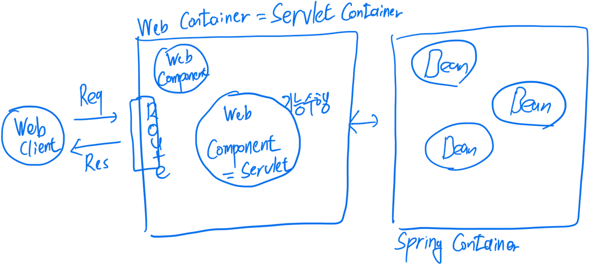

# 스프링부트 살펴보기

## 스프링 부트란?

스프링 부트는 따로 정의하는 개념보다는 스프링을 기반으로 독립실행형 애플리케이션을 간단하고 빠르게 개발하는데 있어서 필요한 여러가지 도구들을 제공해주는 그러한 프레임워크 중 하나이다\
\

스프링 부트의 핵심 목표

1. 매우 빠르고 광범위한 영역의 스프링 개발 경험을 제공
2. 개발하는데 있어서 가장 최대한으로 편리한 방식으로 정해져있는 기술 규칙을 제공한다 >> 따라만 하면 금방할 수 있게 물론 커스텀화도 가능
3. 프로젝트에서 필요한 비기능적인 기술도 지원 > 내장형 서버, 보안, 상태체크 등
4. 코드를 생성해서 우리가 만지는 방식이 아니라 숨기고 알아서 처리해주는 그러한 방식을 채택

\
\

스프링 부트의 역사\

스프링 진영에서 너무 사용하기 어렵다고 containerless 구조를 지원해달라고한 이슈사항의 응답으로 새로운 스프링부트라는 프로젝트를 답변으로 주면서 생겨남\
\
\

Containerless 구조??\
containerless = serverless\
\
위와 같은 구조가 웹 애플리케이션의 기본적인 구조인데, 웹 컨테이너에 존재하는 web.xml, config, classloader 등 여러가지 기본적으로 서블릿 컨테이너 부근에서 설정해주고 개발해줘야 했던 사항들이 있는데, 스프링부트는 이러한 어떻게 보면 실제 로직이 들어가는 스프링 컨테이너의 빈들 부분에만 더욱 집중할 수 있도록 앞단의 작업들을 알아서 기본적으로 진행해준다고 보면 된다\
\
\

## 스프링 부트의 성격

스프링부트는 본인의 주장이 굉장이 쎈 그런 프레임워크이다\
그래서 스프링부트의 설명에도 Opinionated 이라고 되어 있는데 강의에서는 '내가 다 정해줄게 일단 개발만 해' 이렇게 이야기를 하고 있다\
기존의 스프링은 유연함을 추구하고 다양한 관점을 수용하는 등 엄청 자유로운 그러한 프레임워크였다 심지어 스프링 설명에도 Not Opinionated 이라고 되어있다\
유연하고 자유롭다는 의미는 그만큼 불친절하고 그만큼 개발자가 직접 설정해야 하는 사항들이 많다는 의미이다 >> 이것은 결국 이러한 것들을 고민하는데 많은 시간을 쏟는다는 것이다\
이와 반대로 스프링부트는\
Opinionated 하다고 볼 수 있다 > 그냥 이렇게 정해줄테니까 개발이나 먼저하고 나중에 필요하면 알아서 적용해서 사용하라는 방식이다\
여기서 스프링이 지정해주는 것은 사용 기술과 의존 라이브러리이다\
예를 들어서 JPA을 사용한다고 했을 때 필요한 다양한 라이브러리들이나 그것들의 버전들을 다 스프링부트에서 잘 지정해서 전달해준다\
\

기본적으로는 개발에서만 집중할 수 있도록 다 설정해준다고는 했지만 만약에 개발자가 직접 커스텀하거나 확장이 필요한 사항에 대해서는 유연하게 진행될 수 있도록 편리하게 제공한다\
\

## 스프링부트를 이해해야하는 이유

스프링부트는 어떻게 보면 어느정도 내부의 로직만이 있다면 정상적으로 웹 애플리케이션을 만들 수 있도록 지원해주는 프레임워크인데, 편하고 잘 지원해준다는 이유로 모르고 개발하는 것은 좋지 않다고 한다\
스프링부트에서 스프링의 어떠한 기능을 사용하고 있는지, 스프링부트에서 어떤 특정 디폴트 값으로 스프링의 기능을 사용하고 있는지, 필요하다면 스프링부트의 기본 구성을 변경하거나 직접 만드는 방법도 있다\
확실히 본인이 사용하는 프레임워크에 대한 이해력이 필요하다고 생각한다 그래야 본인이 원하는대로 개발을 할 수 있고 이게 왜 되는거지? 에 대한 의구심도 없앨 수 있다\
\
\

\
\
\
\
\
\
\
\
\
\
