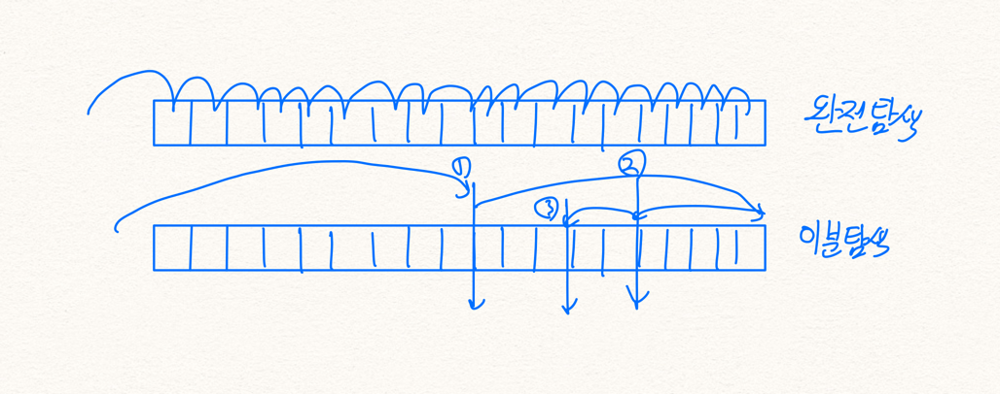

# 숫자 카드(10815)

[https://www.acmicpc.net/problem/10815](https://www.acmicpc.net/problem/10815)\
\
카드의 집합을 만들어 특정 카드가 집합에 있는지 빠르게 찾는 문제\
\


## 문제

숫자 카드는 정수 하나가 적혀져 있는 카드이다. 상근이는 숫자 카드 N개를 가지고 있다. 정수 M개가 주어졌을 때, 이 수가 적혀있는 숫자 카드를 상근이가 가지고 있는지 아닌지를 구하는 프로그램을 작성하시오.

\
\


## 입력

첫째 줄에 상근이가 가지고 있는 숫자 카드의 개수 N(1 ≤ N ≤ 500,000)이 주어진다. 둘째 줄에는 숫자 카드에 적혀있는 정수가 주어진다. 숫자 카드에 적혀있는 수는 -10,000,000보다 크거나 같고, 10,000,000보다 작거나 같다. 두 숫자 카드에 같은 수가 적혀있는 경우는 없다.

셋째 줄에는 M(1 ≤ M ≤ 500,000)이 주어진다. 넷째 줄에는 상근이가 가지고 있는 숫자 카드인지 아닌지를 구해야 할 M개의 정수가 주어지며, 이 수는 공백으로 구분되어져 있다. 이 수도 -10,000,000보다 크거나 같고, 10,000,000보다 작거나 같다\
\


## 출력

첫째 줄에 입력으로 주어진 M개의 수에 대해서, 각 수가 적힌 숫자 카드를 상근이 가지고 있으면 1을, 아니면 0을 공백으로 구분해 출력한다\
\


기준이 되는 숫자의 크기를 받고, 크기만큼 값받아서 기준이되는 배열 혹은 리스트로 구성해두고\
검사하고 싶은 크기만큼의 숫자를 받고, 그 크기만큼 돌면서 해당 숫자가 기준으로 잡은 리스트 혹은 배열에 있는지 확인해서 있으면 1을, 없으면 0을 출력\
\
\


흠... 첫 번째 시도 -> 검사하는 과정을 그냥 ArrayList에서 제공해주는 방식으로 검사해서 가려고 했는데 시간초과... 그냥 배열을 요구하는 것 같다...\


```java
package me.kdshim.kdd_j.Baekjoon;

import java.io.BufferedReader;
import java.io.InputStreamReader;
import java.util.ArrayList;
import java.util.StringTokenizer;

public class arrayList_10815 {
    public static void main(String[] args) throws Exception{
        BufferedReader br = new BufferedReader(new InputStreamReader(System.in));

        int mainCnt = Integer.parseInt(br.readLine());
        ArrayList<Integer> mainList = new ArrayList<>(mainCnt);

        StringTokenizer st = new StringTokenizer(br.readLine());
        for(int i=0 ; i<mainCnt; i++){
            mainList.add(Integer.parseInt(st.nextToken()));
        }

        int comCnt = Integer.parseInt(br.readLine());
        ArrayList<Integer> comList = new ArrayList<>(comCnt);
        int[] comArr = new int[comCnt];

        st = new StringTokenizer(br.readLine());
        for(int i = 0; i<comCnt; i++){
            comArr[i] = Integer.parseInt(st.nextToken());
        }

        int[] result = new int[comCnt];
        for(int i=0; i<comCnt; i++){
            if(mainList.contains(comArr[i])){
                result[i] = 1;
            }else{
                result[i] = 0;
            }
        }

        for(int i=0; i<comCnt; i++){
            System.out.print(result[i] + " ");
        }
    }
}
```

\
\
\
와... 난 리스트 contain 이 시간초과이길래 ArrayList라서 그런가보다 하고 배열로 일일이 비교했더니 이것도 시간초과라네

```java
package me.kdshim.kdd_j.Baekjoon;

import java.io.BufferedReader;
import java.io.InputStreamReader;
import java.util.ArrayList;
import java.util.StringTokenizer;

public class arrayList_10815 {
    public static void main(String[] args) throws Exception{
        BufferedReader br = new BufferedReader(new InputStreamReader(System.in));

        int mainCnt = Integer.parseInt(br.readLine());
        int[] mainArr = new int[mainCnt];

        StringTokenizer st = new StringTokenizer(br.readLine());
        for(int i=0 ; i<mainCnt; i++){
            mainArr[i] = Integer.parseInt(st.nextToken());
        }

        int comCnt = Integer.parseInt(br.readLine());
        int[] comArr = new int[comCnt];

        st = new StringTokenizer(br.readLine());
        for(int i = 0; i<comCnt; i++){
            comArr[i] = Integer.parseInt(st.nextToken());
        }

        int[] result = new int[comCnt];
        for(int i=0; i<comCnt; i++){
            int flag = 0;
            for(int j=0; j<mainCnt; j++){
                if(flag == 0){
                    flag = mainArr[j] == comArr[i] ? 1 : 0;
                }
            }
            result[i] = flag;
        }

        for(int i=0; i<comCnt; i++){
            System.out.print(result[i] + " ");
        }
    }
}
```

\
\
배열로하면.. 전체 탐색이 들어간다.. 전체로 들어간다는 뜻은 그만큼 빠르게 올라간다는 뜻이구나.. 그래서 Set을 사용했다\
ArrayList 와 Set 의 차이는 뭐인가?\
ArrayList 와 Set은 같은 list와 같은 구조이지만 차이는 순서에 있다\
ArrayList은 순서에 대해서 확실하게 나누어지는 순서에 따라서 정렬하는 리스트이지만 Set은 순서에 상관없이 정렬되는 리스트이다\
그래서 이게 굳이 ArrayList을 사용할 필요는 없었따\
\
\


근데 이거말고도 이분탐색이란걸 사용하면 깔끔하게 나온다고 하네\
이분 탐색이란 아래의 그림이다  정의는 이러하다 -> 이분 탐색이라는 알고리즘은 정렬되어 있는 리스트에서 탐색 범위를 절반씩 줄여가며 탐색하는 방법\
여기서 포인트는 이것인 것 같다 **정렬되어있는 리스트**에서 반으로 줄여가며 검색하는 방법\
구현은 3개의 변수 start, end, mid 이렇게 3가지를 가지고 돌려가면서 찾고자하는 부분을 찾는다\
시간복잡도는 O(logN) 이다\
이렇게 보니까 기억이 나네.. 자 몸이 기억하는지 직접 만들어보자\
젠장... 이분탐색... 외우자...\


```java
package me.kdshim.kdd_j.Baekjoon;

import java.io.BufferedReader;
import java.io.InputStreamReader;
import java.util.ArrayList;
import java.util.Arrays;
import java.util.HashSet;
import java.util.StringTokenizer;

public class arrayList_10815 {
    public static void main(String[] args) throws Exception {
        BufferedReader br = new BufferedReader(new InputStreamReader(System.in));

        int mainCnt = Integer.parseInt(br.readLine());
        int[] mainArr = new int[mainCnt];

        StringTokenizer st = new StringTokenizer(br.readLine());
        for (int i = 0; i < mainCnt; i++) {
            mainArr[i] = Integer.parseInt(st.nextToken());
        }

        int comCnt = Integer.parseInt(br.readLine());
        int[] comArr = new int[comCnt];

        st = new StringTokenizer(br.readLine());
        for (int i = 0; i < comCnt; i++) {
            comArr[i] = Integer.parseInt(st.nextToken());
        }

        int[] result = new int[comCnt];

        Arrays.sort(mainArr);

        for(int i=0; i<comArr.length; i++){
            result[i] = binarySearch(mainArr, comArr[i]);
        }

        for (int i = 0; i < comCnt; i++) {
            System.out.print(result[i] + " ");
        }
    }

    public static int binarySearch(int[] arr, int index) {
        int start = 0;
        int end = arr.length - 1;
        int mid;

        while (end - start >= 0) {
            mid = (end + start) / 2;

            if (arr[mid] == index) {
                return 1;
            } else if (arr[mid] < index) {
                start = mid + 1;
            } else {
                end = mid - 1;
            }
        }

        return 0;
    }
}
```

추가로 소름돋는건 이진탐색은 메소드로 이미 구현이 되어있다는점!\


```java
package me.kdshim.kdd_j.Baekjoon;

import java.io.BufferedReader;
import java.io.InputStreamReader;
import java.util.ArrayList;
import java.util.Arrays;
import java.util.HashSet;
import java.util.StringTokenizer;

public class arrayList_10815 {
    public static void main(String[] args) throws Exception {
        BufferedReader br = new BufferedReader(new InputStreamReader(System.in));

        int mainCnt = Integer.parseInt(br.readLine());
        int[] mainArr = new int[mainCnt];

        StringTokenizer st = new StringTokenizer(br.readLine());
        for (int i = 0; i < mainCnt; i++) {
            mainArr[i] = Integer.parseInt(st.nextToken());
        }

        int comCnt = Integer.parseInt(br.readLine());
        int[] comArr = new int[comCnt];

        st = new StringTokenizer(br.readLine());
        for (int i = 0; i < comCnt; i++) {
            comArr[i] = Integer.parseInt(st.nextToken());
        }

        int[] result = new int[comCnt];

        Arrays.sort(mainArr);

        for(int i=0; i<comArr.length; i++){
            result[i] = Arrays.binarySearch(mainArr, comArr[i]) >= 0 ? 1 : 0;
        }

        for (int i = 0; i < comCnt; i++) {
            System.out.print(result[i] + " ");
        }
    }

}
```

이렇게 그냥 따로 구현하지 않고 있는거 사용도 가능은 하다\
\


아무튼 이분탐색 외우자\
start 0\
end 탐색배열크키\
start - end > 0 일때 무한루프로 체크\
mid = (start + end)/2 로 세팅\
만약에 arr\[mid] == 검사할놈 이면 찾았다는 사인을 리턴\
만약에 arr\[mid] < 검사할놈 이면 시작지점이 중간부터여야 하기 때문에 start = mid + 1\
나머지인 경우에는 뒤에서 하나씩 넘어와야 하기 때문에 end = mid - 1\
이러한 구조로 외워두자 이진탐색은 구현하고 사용하는건 조금만 생각하면되니 구현에 집중하자\
\
\
\


\
\
\
\
\
\
\
\
\
\
