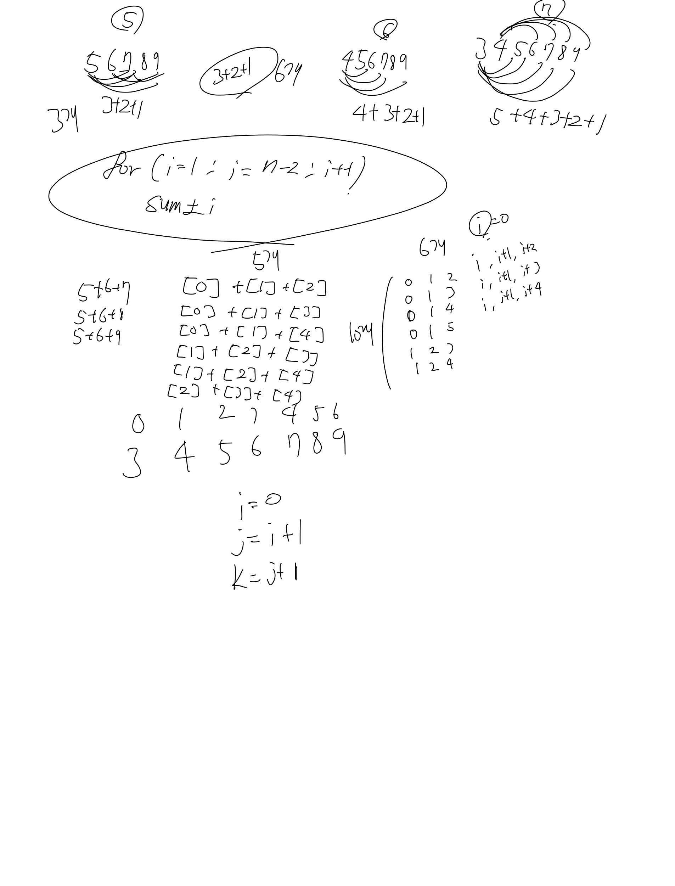

# 블랙잭(2798)

## 문제

카지노에서 제일 인기 있는 게임 블랙잭의 규칙은 상당히 쉽다. 카드의 합이 21을 넘지 않는 한도 내에서, 카드의 합을 최대한 크게 만드는 게임이다. 블랙잭은 카지노마다 다양한 규정이 있다.

한국 최고의 블랙잭 고수 김정인은 새로운 블랙잭 규칙을 만들어 상근, 창영이와 게임하려고 한다.

김정인 버전의 블랙잭에서 각 카드에는 양의 정수가 쓰여 있다. 그 다음, 딜러는 N장의 카드를 모두 숫자가 보이도록 바닥에 놓는다. 그런 후에 딜러는 숫자 M을 크게 외친다.

이제 플레이어는 제한된 시간 안에 N장의 카드 중에서 3장의 카드를 골라야 한다. 블랙잭 변형 게임이기 때문에, 플레이어가 고른 카드의 합은 M을 넘지 않으면서 M과 최대한 가깝게 만들어야 한다.

N장의 카드에 써져 있는 숫자가 주어졌을 때, M을 넘지 않으면서 M에 최대한 가까운 카드 3장의 합을 구해 출력하시오.

## 입력

첫째 줄에 카드의 개수 N(3 ≤ N ≤ 100)과 M(10 ≤ M ≤ 300,000)이 주어진다. 둘째 줄에는 카드에 쓰여 있는 수가 주어지며, 이 값은 100,000을 넘지 않는 양의 정수이다.

합이 M을 넘지 않는 카드 3장을 찾을 수 있는 경우만 입력으로 주어진다.

## 출력

첫째 줄에 M을 넘지 않으면서 M에 최대한 가까운 카드 3장의 합을 출력한다.

## 예제 입력

```
5 21
5 6 7 8 9
```

## 예제 출력

```
21
```

## 예제 입력2

```
10 500
93 181 245 214 315 36 185 138 216 295
```

## 예제 출력2

```
497
```

브루트 포스이기 떄문에 모든 경우의 수를 계산해봐야한다.

3개의 수를 뽑아서 계산해야 하기 때문에 각 3개에 대해서 모든 경우의 수를 세기 위한 3중 for문을 사용하는 방법을 이용해서 문제를 풀어보았다.

## 풀이

```java
import java.util.*;

public class Main{
    public static void main(String[] args) {
        Scanner sc = new Scanner(System.in);
        int sum=0;
        int N = sc.nextInt();
        int M = sc.nextInt();
        int arr[] = new int[N];
        for(int i=0; i<N; i++){
            arr[i] = sc.nextInt();
        }

        for(int i=0; i<arr.length; i++){
            //j=1
            for(int j=i+1; j<arr.length; j++){
                //k=2
                //#1 이렇게 두고했었는데... 이게 유동적으로 움직이는게 맞다고 생각해서 바꿔봤는데맞음-> 답확인해보
                //#2 자꾸틀려서 k=i+2에서 k=j+1로 변경했더니 맞음
                for(int k=j+1; k<arr.length; k++){
                    int tmp = arr[i]+arr[j]+arr[k];
                    if(sum<tmp && tmp<=M)
                        sum=tmp;
                }
            }
        }
        System.out.println(sum);
    }
}
```

[백준](https://www.acmicpc.net/problem/2447)

## 2번째 시도

어렵지 않게 문제 풀 수 있었다. 브루트 포스를 알고 있어서 그런가 어렵지만은 않았당



```java
import java.io.*;
import java.util.Arrays;

public class Main {
    public static void main(String[] args) throws Exception{
        BufferedReader bf = new BufferedReader(new InputStreamReader(System.in));
        BufferedWriter bw = new BufferedWriter(new OutputStreamWriter(System.out));
        String[] recv = bf.readLine().split(" ");
        int n = Integer.parseInt(recv[0]);
        int max = Integer.parseInt(recv[1]);
        recv = bf.readLine().split(" ");
        int[] arr = new int[n];
        for (int i=0; i<arr.length; i++) {
            arr[i] = Integer.parseInt(recv[i]);
        }

        int tMax=0;
        for(int i=0; i<arr.length-2; i++){
            for(int j=i+1; j<arr.length-1; j++){
                for(int k= j+1; k<arr.length; k++){
                    int tmp = arr[i] + arr[j] + arr[k];
                    if(tmp <= max && tMax <tmp)
                        tMax = tmp;
                }
            }
        }

        bw.write(tMax+"\n");
        bw.flush();
    }
}
```
