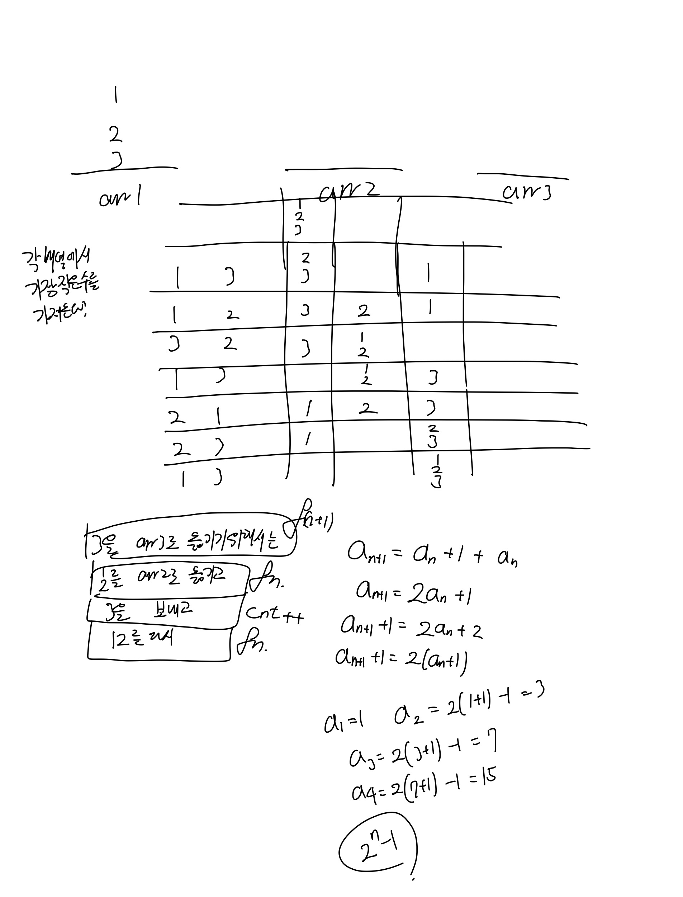

# 하노이 탑 이동 순서\(11729\)

## 문제

세 개의 장대가 있고 첫 번째 장대에는 반경이 서로 다른 n개의 원판이 쌓여 있다. 각 원판은 반경이 큰 순서대로 쌓여있다. 이제 수도승들이 다음 규칙에 따라 첫 번째 장대에서 세 번째 장대로 옮기려 한다.

1. 한 번에 한 개의 원판만을 다른 탑으로 옮길 수 있다.
2. 쌓아 놓은 원판은 항상 위의 것이 아래의 것보다 작아야 한다.

이 작업을 수행하는데 필요한 이동 순서를 출력하는 프로그램을 작성하라. 단, 이동 횟수는 최소가 되어야 한다.


## 입력

첫째 줄에 첫 번째 장대에 쌓인 원판의 개수 N \(1 ≤ N ≤ 20\)이 주어진다.


## 출력

첫째 줄에 옮긴 횟수 K를 출력한다.

두 번째 줄부터 수행 과정을 출력한다. 두 번째 줄부터 K개의 줄에 걸쳐 두 정수 A B를 빈칸을 사이에 두고 출력하는데, 이는 A번째 탑의 가장 위에 있는 원판을 B번째 탑의 가장 위로 옮긴다는 뜻이다.


## 예제 입출력

### 예제 입력

```text
3
```

### 예제 출력

```text
7
1 3
1 2
3 2
1 3
2 1
2 3
1 3
```




하노이의 탑의 공식이 있었다니... 몰랐다.... 

도움을 받아서 풀긴했는데, 힌트보니까 금방할 수 있었다.

추가적인 문제는 어떻게 구현할지였는데, 

재귀를 돌 때 처음으로는 가장 높은 숫자를 원하는 위치로 보내기 위해서 

가장 높은 숫자의 위에 있는 것들을 남는 곳에다가 두어야하고\(start -&gt; mid\)\(start에서 시작해서 ed를 거쳐서 mid로 보냄\)

가장 높은 숫자를 원하는 곳에 두고 \(start -&gt; end\)

남은 곳에다가 둔 것을 다시 원하는 위치에 둔다\(mid -&gt; end\)\(mid에서 시작해서 st를 거쳐 ed로 보냄\)

```java
import java.io.*;

public class Main {
    static BufferedReader bf = new BufferedReader(new InputStreamReader(System.in));
    static BufferedWriter bw = new BufferedWriter(new OutputStreamWriter(System.out));

    public static void main(String[] args) throws Exception{
        int n = Integer.parseInt(bf.readLine());
        bw.write((int)Math.pow(2, n) - 1 + "\n");
        fn(n, 1, 2, 3);
        bw.flush();
    }

    static void fn(int n, int st, int mid, int ed) throws IOException {
        if(n == 1){
            bw.write(st + " " + ed + "\n");
            return;
        }

        fn(n-1, st, ed, mid);
        bw.write(st + " " + ed + "\n");
        fn(n-1, mid, st, ed);
    }
}
```

Scanner 대신 BufferedReader bf = new BufferedReader\(new InputStreamReader\(System.in\)\);

System.out.println 대신 BufferedWriter bw = new BufferedWriter\(new OutputStreamWriter\(System.out\)\);

+ bw.write/형변환 + bw.flush\(\)

거듭제곱을 표현하기 위해서 사용한 방법이 Math.pow\(밑의수, 제곱할 수\)


