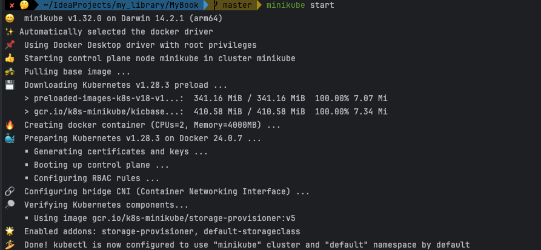
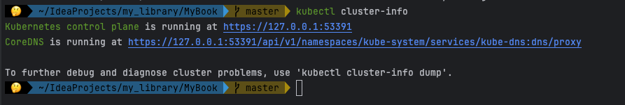

mac 에서 진행 <br>
minikube 란 로컬 환경에서 클러스터 구조를 만들어서 실제로 운영에서 DevOps 를 구성하기 전, 로컬에서 테스트 삼아 진행하기 위한 도구라고 생각하면 된다 <br>

minikube 설치 <br>

https://minikube.sigs.k8s.io/docs/start/ <br>
해당 링크는 공식 홈페이지에서 minikube 를 설치하는 방법에 대해서 잘 알려준다 <br>
mac os 를 사용하고 있고 홈페이지의 가이드에 기본적으로 2 GB 메모리를 사용하고, 20GB 를 사용하고 인터넷이 필요하다고 한다 <br>
그나마 익숙한 homebrew 를 사용해서 설치를 진행 <br>

``` brew install minikube ```

minikube 을 설치했으니, 이제 클러스터를 실행 <br>

``` minikube start ```

위 명령어를 통해서 클러스터를 실행시켜주는데, 기본적으로 docker 의 image 을 기반으로 진행되기 때문에 docker 가 설치되어 있어야 한다는 점! <br>
❌  Exiting due to DRV_DOCKER_NOT_RUNNING: Found docker, but the docker service isn't running. Try restarting the docker service. <br>
도커가 없다면 위와 같은 에러가 발생한다 <br>
<br><br>


도커가 설치된 상태로 다시 minikube start 명령어를 실행시키면 필요한 docker image 를 다운받고, 그걸 실행해서 클러스터 구조를 형성한다 <br>
<br>
기본으로 제공해주는 클러스터를 실행한 화면 


이렇게 실행하고 docker ps 을 통해서 minikube 시작 시 어떤 이미지를 받아왔는지 조회해보면 
minikube container 를 다운 받고 실행시킨 것을 확인할 수 있음 <br>
뿐만아니라 kubectl 명령어에 적용되어 사용될 수 있도록 세팅 파일까지 만들어서 적용해줌 <br>
~/.kube/config 파일을 봐보면 어떤 형식으로 현재 클러스터가 구정되어있는지 그 설정값을 관리하는 yml 파일이 만들어져 있는 것을 확인할 수 있다 <br>
<br><br>

그럼 어떻게 클러스터가 구성되었는지 확인하는 방법은 <br>
``` kubectl cluster-info ```

이렇게 현재 클러스터가 잘 돌고 있는것을 확인할 수 있다 <br>
<br>

클러스터 일시중지 <br>
``` minikube pause ```

클러스터 재기동 <br>
``` minikube unpause ```

클러스터 종료 - 재시작용 명령어 <br>
(minikube container 가 종료되며 config 파일도 삭제되지만 클러스터가 사용했던 리소스는 그대로 유지됨) <br>
``` minikube stop ```

클러스터 삭제 <br>
(stop 과 동일하지만 클러스터 리소스까지 다 삭제)
``` minikube delete ```

<br><br>

이제는 minikube 을 시작할 때 어떻게 내가 원하는 방식으로 구성해서 클러스터를 실행할 수 있을까에 대해서 공부해보자 <br>
<br><br><br><br><br><br><br><br><br><br>