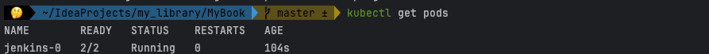

minikube 을 설치했고 그 사용방식에 대해서 파악한 상황 <br>
다음으로 진행할 작업은 >> jenkins 를 클러스터 내부에 포함시켜서 깃헙을 바라보도록 설정해서 
web hook 을 통해 자동으로 파일의 푸쉬와 함께 jar 파일이 생성되도록 설정하는 것이 목표 <br>
<br><br>

helm charts 을 통해서 클러스터 내부에 jenkins 를 설치해줄 수 있다 <br>
helm 을 사용하기 위해서는 따로 설치를 진행해야 사용할 수 있더라.. <br>
``` brew install helm ```
helm 을 homebrew 으로 설치 <br>
<br>

이후엔 helm 을 통해서  jenkins helm 차트를 클러스터에 설치하자 

```shell
helm repo add jenkins https://charts.jenkins.io
helm repo update
helm install jenkins jenkins/jenkins
```
위 명령어를 통하면 helm 에 jenkins 내 클러스터에 젠킨스 pods 을 생성해준다 <br>
<br>

``` kubectl get pods ```
<br> 위 명령어를 통해서 정상적으로 젠킨스가 내 클러스터에서 실행중인지 확인할 수 있음


jenkins 을 설치하고 로그를 쭉 봐보면, 2가지의 단계를 거치라고 나오는 듯 하다 <br>
1. admin 정보를 설정해준다 
2. 젠킨스 url 로 들어가본다
   - echo http://127.0.0.1:8080
   - kubectl --namespace default port-forward svc/jenkins 8080:8080
3. 1에서 설정한 id - admin / pw - ?? 로 로그인
4. 젠킨스의 시큐리티나 뭐 인증과정 추가하라 
5. 이제 configScript 을 통해서 설정하라

<br>
원본은 아래 <br>

```shell
NAME: jenkins
LAST DEPLOYED: Mon Jan 29 22:25:52 2024
NAMESPACE: default
STATUS: deployed
REVISION: 1
NOTES:
1. Get your 'admin' user password by running:
  kubectl exec --namespace default -it svc/jenkins -c jenkins -- /bin/cat /run/secrets/additional/chart-admin-password && echo
2. Get the Jenkins URL to visit by running these commands in the same shell:
  echo http://127.0.0.1:8080
  kubectl --namespace default port-forward svc/jenkins 8080:8080

3. Login with the password from step 1 and the username: admin
4. Configure security realm and authorization strategy
5. Use Jenkins Configuration as Code by specifying configScripts in your values.yaml file, see documentation: http://127.0.0.1:8080/configuration-as-code and examples: https://github.com/jenkinsci/configuration-as-code-plugin/tree/master/demos

```


1번 작업을 수행하면 admin 의 비밀번호를 알려준다 >> Ui9ZA4K6dR8Y9jyWTR66zF <br>
2번 작업을 수행하면 jenkins 의 포트를 8080으로 설정해주어 웹 페이지에서 접근하는 것이 가능해진다 <br>
이제는 Jenkins 설정을 통해서 깃 을 가져와서 사용하면 되겠다 <br>
<br><br>
