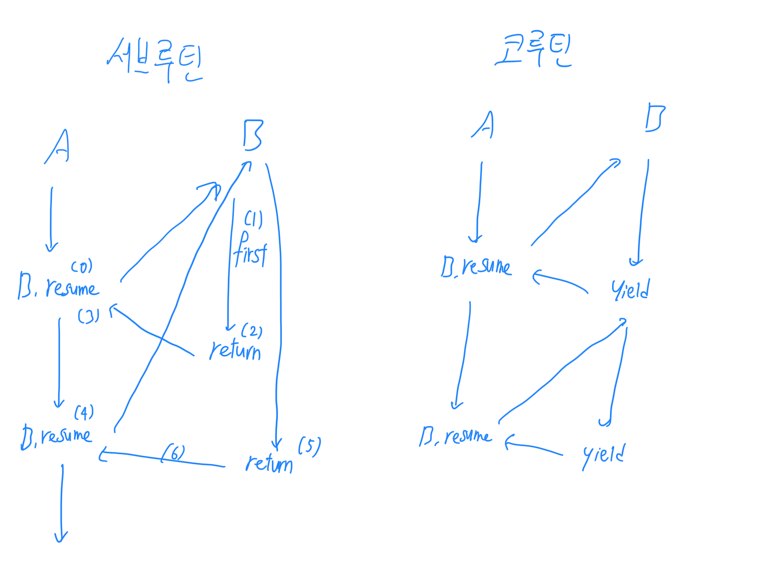

# 코루틴

\
\
\

## 코루틴?

코루틴이란 컴퓨터 프로그램 구성 요소 중 하나로 비선점형 멀티태스킹을 수행하는 일반화한 서브 루틴이다\
여기서 서브루틴이란 여러 명령어를 모으고, 이름을 줌으로써 반복해서 호출할 수 있도록 정의한 프로그램 요소이고 간단하게 말해서 그냥 함수이다\
어떻게 보면 객체 지향 언어에서의 메소드를 보고 서브루틴이라고도 할 수 있다\
서브루틴으로 진입하는 방법은 오직 한 가지이고 그때마다 활성 레코드라는 것이 스택에 할당되면서 서브루틴 내부의 로컬 변수 등이 초기화된다\
반면, 서브루틴 안에서 여러번 return 을 사용할 수 있기 때문에 서브루틴이 실행을 중단하고 제어를 호출한 쪽에게 돌려주는 지점은 여럿 있을 수 있다\
다만 서브루틴에서 반환하되고 나면 활성 레코드가 스택에서 사라지기 때문에 모든 상태를 잃어버린다 > 그래서 서브루틴은 계속 반복해도 같은 결과만이 나온다\
\

코루틴이란 서로 협력해서 실행을 주고 받으며 작동하는 여러 서브루틴을 의미한다\
코틀린의 대표인 generator를 보면 어떤 함수 A가 실행되다가 코루틴인 generator인 B를 실행하면 > A가 실행해된 스레드 안에서 코루틴 B의 실행이 시작된다\
코루틴 B는 계쏙해서 실행되다가 실행을 A에게 yield 이라는 명령을 통해서 양보한다\
A는 그럼 다시 코루틴을 호출했던 바로 다음 부분부터 실행을 진행하다가 다시 또 B를 호출한다. 이때 B가 일반적인 함수라면 로컬 변수를 초기화하면서 처음부터 실행을 다시 시작하겠지만 yield 시점을 기준으로 다시 한다\
복잡하다... 그림으로 보자\
\

음음... 코루틴을 사용하면 일반적인 프로그램 로직을 기술하듯 코드를 작성하고 상대편 코루틴에 데이터를 넘겨야 하는 부분에서만 yield을 사용하면 된다는 점이다\
\
\

그래서 대충 개념적으로 보면 같은 스레드에서 뭔가 진행되고 있어도 코루틴으로 넣어주면 사부작사부작 돌아가면서 진행해준다라는 개념으로만 알고 있으면 될 것 같다\
\

물론 필요할때 다시 조금 더 찾아보고 진행해야하겠지만 일단은 개념적인 면이라도 보자\
\
\

\
\
\
\
\
\
\
\
\
\
