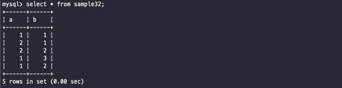
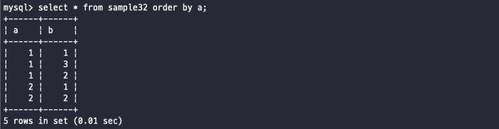
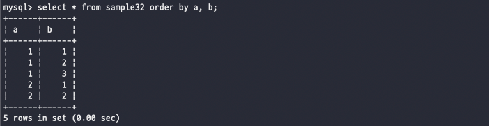
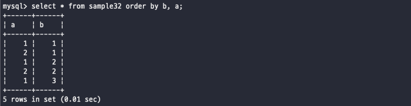

# 복수의 열을 지정해 정렬하기
이전 챕터에서 order by 구를 사용해서 행을 정렬할 수 있는데, 다수의 열을 지정해 정렬하는 방법
<br><br>

어떻게 사용하냐
```SQL
SELECT 행 FROM 테이블 WHERE 조건식 ORDER BY 행1, 행2
```
이게 데이터가 정--말 많은 경우에는 하나의 행으로는 원하는 데이터의 순서를 가리기 어렵기 때문에
필요할 때는 이렇게 복수의 열을 사용해서 지정해서 정렬할 수 있다
<br>

## 복수 열로 정렬 지정
단일로 열을 정렬할 때는 단순하게 정렬방식만 정해주면 숫자는 대소비교, 문자는 사전순으로 정렬이 되었는데...
만약에 값이 같으면 어떤 것을 기준으로 순서를 정해야 하나? -> 따로 지정해주지 않는다면 랜덤이다
<br>

예시로 sample32 테이블을 보자
<br>


<br>
슬쩍 보면 a, b 모두 숫자인데, a를 기준으로해서 값들을 정렬해보려고 한다<br>
그러면 일단 order by a를 붙혀보자<br>


<br>
a의 값이 1인 열들을 봐보자 -> 1, 3, 2 이렇게 정렬되어 있지 않게 출려이 된다
-> 결국 서로 값이 똑같으면 순서를 정렬할 수 없다는 것!!!
<br><br>

#### 그러면 복수 열을 지정하면 어떨까?
위에서 간단하게 보여줬지만 order by 뒤에 원하는 행들을 작성하여 복수의 열을 정렬할 수 있다
**이렇게 지정한 순서는 정렬하는 순서이다**
앞에 있는 필드로 먼저 정렬을 한 뒤, 그 이후에 정렬한 값들 중에 값은 값이 있다면 그 다음의 기준을 뒤의 필드로 정렬한다
<br>

그럼 이전에 위에서 한 번 조회해본 값들을 a로 먼저 정렬하고, 그 이후에 b로 정렬해보자..!

<br>

이렇게 order by a 뒤에 b를 붙혀주니까 정렬되지 않았던 b의 값들이 정렬되서 출력되는 것을 확인할 수 있다
<br>

그럼 하는 김에 반대도 확인해보자!
<br>


<br>
이제는 b를 기준으로 먼저 정렬이 되어있고, b의 값이 같은 열끼리 비교해서 a 순서대로 정렬한 모습을 볼 수 있다
<br><br><br><br>

## 정렬방식 지정가능
소제목 말 그대로 order by의 뒤에는 다수의 필드(행)을 넣어줘서 다수의 정렬이 가능한데, 
이외에도 정렬 방식 또한 쉽게 붙혀서 정하는 것이 가능하다
```SQL
SELECT 필드 FROM 테이블 ORDER BY 필드1 [ASC/DESC], 필드2 [ASC/DESC];
```
단순하게 뒤에 어떻게 정렬할 것인지 작성하면 되는데, 좀 길어지니까 오름차순이면 그냥 생략하자...
<br><br><br><br>

## NULL값의 정렬순서
NULL 값이라는 것은 대소 비교를 할 수 없기 때문에 애초에 별도의 방법으로 취급하는 데이터이다
<br>
null값은 애초에 어떤 특정 값이 있는 값보다 크거나 작게 결정된다
<br>
그 의미는 null값을 가지는 행은 가장 먼저 출력되거나 가장 마지막에 출력된다
<br><br>
예시로 mysql에서는
- 오름차순(ASC)일 때는 가장 위에 존재하는 값이고
- 내림차순(DESC)일 때는 가장 아래에 존재하는 값이다

<br><br><br><br><br>