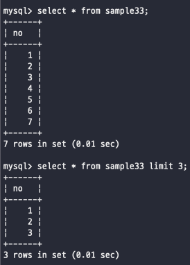
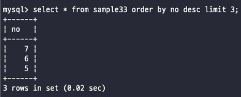
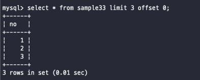
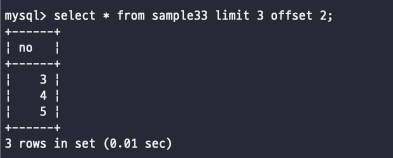

# 결과 행 제한하기
_select 명령으로 결과값을 반환하는데 있어서 행을 제한하는 것이 가능한데, limit구로 결과 행을 제한_

<br>
사용방법
<br>

```SQL
SELECT 필드 FROM 테이블 LIMIT 행수 [OFFSET 시작행] 
```
<br><br>

## 행수 제한
LIMIT 구는 표준으로 정의된 SQL이 아니다..! -> mysql, postgresql에서만 지원하는 문법..
<br>
LIMIT 구를 붙히는 곳은 SELECT 명령에서 사용할 수 있고 위치는 WHERE, ORDER BY 구의 뒤에 지정

```SQL
SELECT 필드 FROM 테이블 WHERE 조건식 ORDER BY 필드 LIMIT 행수
```
<br>

이렇게 여러 행을 가지고 있어도 limit을 통해서 원하는 숫자만큼만 사용하는 것이 가능하다


<br><br>

limit를 통해서 값들을 뽑는 것은 정렬까지 모두 끝마치고 나서야 진행되는 일이기 때문에
정렬이 되고 나서 그 이후에 값들을 가지고 정렬을 하는 방식이다
그래서 오름차순이 아닌 내림차순으로 변경하고 행수를 제한하는 것도 가능하다
<br>


<br>
요렇게 no의 행 중에서 가장 높은 no부터 3개가 출력되는 것을 볼 수 있다
<br><br>

아까 말한대로 limit는 mysql, postresql에서만 적용되는 예약어인데 내가 회사에서 사용하는 오라클에서는
ROWNUM이라는 예약어를 사용한다
```SQL
SELECT * FROM sample33 WHERE ROWNUM<=3;
```
<br>
ROWNUM은 클라이언트에게 결과가 반환될 때 각 행에 할당되는 행 번호이다
하지만 where구로 지정하기 때문에 정렬하기 전에 처리되서 limit를 사용했을 때와 결과값이

<br><br><br>
## 오프셋 지정
데이터를 가져오는데 있어서 데이터가 많은 경우에는 한꺼번에 다 들고 와서 뿌리는 건 성능적으로도 정말 좋지 않다
그래서 일반적으로 페이징(paging)을 통해서 데이터를 나눠서 가져오곤 한다
<br>

데이터베이스에서 그러한 페이징 기법은 limit을 통해서 사용해 볼 수 있다
OFFSET이라는 것을 사용할 수 있는데 offset은 select의 시작점(offset 부터)을 정하는 것이다
<br>

예시로 첫 번째 페이지에서는 0번째 데이터부터 3개의 데이터를 보여주고싶다 하면 이렇게

<br>
두 번째 페이지에서는 3번째 데이터부터 3개의 데이터를 보여주고 싶다 하면 이렇게

<br>

offset의 기본값은 0으로 지정하지 않으면 처음부터 시작을 하게 된다
offset의 값을 지정하늗네 있어서 배열 인덱스와 같다 첫번째가 0부터 시작해서 하나씩 올라가는 구조이라는 점을 기억하자!
<br>

<br><br><br><br><br><br><br><br><br><br>