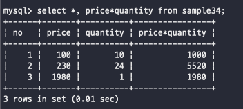
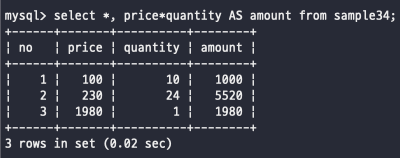
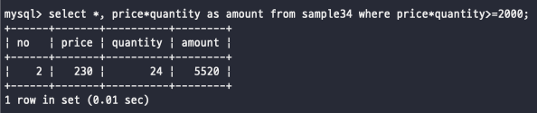
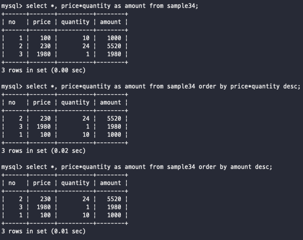
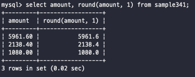

# 수치 연산
데이터 베이스에서는 계산 기능을 제공해주고 있는데 그걸 한번보자**

## 사칙 연산
가장 기본적인 연산부터 확인해보자  
덧셈, 뺄셈, 곱셈, 나누셈, 나머지 이렇게 존재한다
덧셈은 +  
뺄셈은 -  
나눗셈은 /  
곱셈은 *  
나머지는 %  

 
나머지는 데이터베이스마다 다른데 MOD함수를 제공해주는 데이터베이스도 있으니까 필요하면 사용
 

연산자를 사용하는데 있어서 우선순위가 존재한다  
가장 먼저 계산이 이루어지는 연산자는 *, /, % 가 우선적으로 이루어지고  
다음으로 +, - 이 이루어진다  
우리가 기본적으로 사용해왔던 연산 그--대로 사용할 수 있다..!  
 

추가적으로 이러한 산술 연산자는 SELECT 구에서나 WHERE 구 어디서든 사용할 수 있으니까 자유롭게 사용하자
   

## SELECT 구로 연산하기
 
요렇게 단순하게 계산하고 싶은거에다가 넣어서 계산하면 된다!
   

## 열의 별명
위에서 사용한걸 봐보면 이게 select문에서 사용하게 되면 어떻게 계산했는지 연산자대로 결과가 나옴  
그래서 여기서는 별명(alias)을 사용해서 이쁘게 출력할 수 있다는거!  
  
이렇게 별명은 AS라는 예약어를 사용해서 넣을 수 있다  
별명은 기본적으로 **중복되지 않게** 지정하자  
 
심지어 AS 예약어는 생략해서 사용하는 것도 가능!  
별명을 한글로 사용할 때는 ASCII 문자 이외의 것을 포함하는 경우외에는 ""을 사용해서 넣어주자  
이외에도 SELECT와 같은 예약어를 별칭으로 사용할 때도 ""을 통해서 넣어주면 된다  
   

## WHERE 구에서 연산하기
이번에는 where 절에서 사용해보자  
  
근데 여기서 별칭으로 지정해줬는데 이걸 다시 굳이 예약어를 사용하지 않고 왜 다시 연산까지 넣어줬을까...?  
이유는 WHERE 구와 SELECT 구의 내부 처리 순서에 있다  
데이터베이스 서버 내부에서의 처리 순서는 WHERE -> SELECT  
그래서 결과적으로 보면 **SELECT 구에서 지정한 별명은 WHERE 구 안에서 사용할 수 없다는 거!** 
   

## Null 값의 연산
과거에도 언급했던 내용이지만 NULL 값은 계산을 할 수 있는 그러한 개념이 아니라고 언급했던 과거가 있다  
NULL 에다가 어떠한 숫자를 사칙연산을 넣어줘도 값은 항상 NULL이 출력된다!!!  
   

## ORDER BY 구에서 연산
와우 order by에서도 계산을 해서 정렬할 수 있구나!!  

order by 는 가장 마지막에 처리된다는 점을 기억하자  
자 order by를 가장 마지막에 처리한다면 -> 그 의미는 별칭을 where 절에서도 가져올 수 있다는 점!  
   

## 함수
연산자 이외에도 함수를 통해서 계산할 수 있다  
함수는 계산 대상을 파라미터로 지정을 해주고, 그 인수는 함수명 뒤에 괄호로 묶어서 표기한다  
어떻게 보면 사실 함수를 통해서 원하는 결과를 가져오는 것이기 때문에 단순하게 연산자를 사용하는 것과 같다  
위에서 나머지를 구할 수 있는 MOD함수를 예시로 들 수 있으며 MOD(10, 3) 이렇게 넣어주면 10을 3으로 나눈 나머지라는 의미를 가진다  
   

## ROUND 함수
ROUND는 반올림을 도와주는 함수이다  
따로 설정을 해주지 않는다면 소수를 정수로 만들어준다 즉 그 의미는 소수의 첫 번째 자리를 기준으로 해서 진행이 된다 
하지만 추가적으로 원하는 자릿수를 지정하는 것이 가능하다  
  
이렇게 두 번째 파라미터에 원하는 자릿수를 넣어주면 해당 자리에서 반올림을 진행해준다  
이외에도 소수점이 아니라 정수자리에서도 반올림을 해줄 수 있다 -> 음수를 지정해주면 된다  
-1부터 시작해서 -1이면 일의 자리, -2이면 십의 자리, -3이면 백의 단위에서 반올림을 진행해 준다  
 
반올림 이외에도 버림도 TRUNCATE 함수를 사용해서 가능하다는 것  
추가적으로 sin, cos와 같은 삼각 함수, 루트를 계산하는 sqrt, 합을 해주는 sum등등 다수의 함수가 존재하기 때문에 구글링 진행하면서 사용하자  

