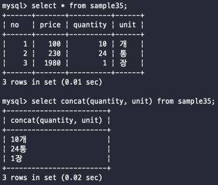

# 문자열 연산
_데이터는 솔직히 숫자보다 문자열이 몇배는 더 많음... 문자열을 조작하는 방법을 한번 봐보자_
 

## 문자열 결합
데이터베이스에서의 문자열 결합이란 뭐 데이터 문자를 합치는 과정을 의미  
그렇다고 무조건 varchar만 연산이 가능하고 그런건 아니고 integer와도 연결이 가능은 함  
문자열을 결합하는 연산자는 데이터베이스마다 다 다른 방언으로 사용되고 있다  
Oracle, DB2, PostgreSQL -> ||
MySQL -> CONCAT
이렇게 대표적인 것을 기억해두자!  
현재 진행은 mysql을 통해서 하고 있기 때문에 한 번 해보자  
  
위에서 잠깐 이야기했듯이, 숫자와 문자열을 조합하는 것도 가능  

   

## SUBSTRING 함수
자바에서 사용해본적 있는 함수이다 -> 문자열의 원하는 부분을 index을 이용해서 잘라내서 리턴해주는 함수  
꼭 SUBSTRING 이 아니라 데이터베이스에 따라서 SUBSTR 인 경우도 있다  
substring 함수의 사용은 날짜를 가져올 때 많이 사용했던 것 같다  
yyyymmddHHmmss 이런 방식으로 저장된 데이터에서 연도만 추출할 때? 이럴때 사용하면 좋음  
   

## TRIM 함수
이것도 자바에서 본적 있다 -> 문자열을 확인해서 문자열의 맨앞과 맨뒤에 존재하는 공백(스페이스바)를 찾아서 제거해주는 함수  
맨 앞과 맨 뒤만 찾기 때문에 문자열 사이에 존재하는 공백은 냅둔다는 것  
   

## CHARACTER_LENGTH 함수
뭔가 함수의 이름이 길어진 것 같은데, 문자열의 길이를 리턴해주는 함수  
CHAR_LENGTH으로도 줄일 수 있다네..? 이게 가능한가..? 그리고 이 함수와 쌍으로 OCTET_LENGTH가 있는데 요 함수는 길이를 바이트 단위로 계산해줌  
 
#### character set
알파벳을 보고 반각문자, 한글을 보고 전각문자라고 부르기도 하는데, 이 둘의 차이는 데이터로 칠 때 차이가 보인다  
반각문자는 전각문자 폭의 절반도 안되고 저장용량 또한 전각문자 쪽이 훨씬 크다..! 
RDBMS에서는 한글을 EUC-KR이나 UTF-8등의 인코딩 방식을 사용하는데 인코딩의 방식을 보고 character set(문자세트)라고 부른다  

단순한 CHAR_LENGTH는 문자열의 문자 길이로 계산 하지만  
한 문자가 몇 바이트로 쓰지는지에 따라서 OCTET_LENGTH가 달라지기 때문에 항상 주의를 해두자!  
그렇기 때문에 데이터베이스까 어떠한 character set을 사용하는지는 알아두는게 좋겠다  

          