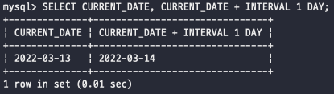

# Day 14

_날짜 - 시간 데이터를 저장하고 연산하는 방법에 대해서 알아보자_\

## SQL에서의 날짜

날짜나 시간 데이터는 수치 데이터와 같이 사칙 연산이 가능함\
날짜시간 데이터를 어떻게든 연산을 때리면 결과값으로 날짜시간 데이터를 뱉는 경우도 있고 기간형(interval)이 나오는 경우도 있음\
\

#### 시스템 날짜

RDBMS에는 현재 시스템의 날짜와 시간을 확인할 수 있는 함수가 존재한다\
표준 SQL에서는 'CURRENT\_TIMESTAMP'이라는 함수를 통해서 현재 시스템의 시간을 찾을 수 있음\
특이하게도 함수이지만 파라미터 같은게 필요없기 때문에 ()없이 단순히 함수명으로 원하는 동작을 사용 가능\
이외에도 Oracle에서는 SYSDATE 함수가 존재하고 있으며 SQL Server에서는 GETDATE 함수를 사용해서 시스템 날짜를 확인\
하지만 그래도 일단은 '표준'은 아니기 때문에 'CURRENT\_TIMESTAMP'를 사용하자\
\
\

#### 날짜 서식

날짜 데이터를 디비에 저장하는 경우, CURRENT\_TIMESTAMP를 사용해서 시스템 상의 날짜를 저장하는 것이 가능하다\
하지만 임의의 날자를 저장하고 싶은 경우에는 직접 날짜를 정해줘야겠지?\
근데 날짜의 서식은 나라별로 다르다는게 조금은 사고이긴 하다 그래서 각 디비에는 날짜 데이터를 서식할 수 있는 함수를 지원\
\
예시로 oracle에서는 TO\_DATE 함수를 사용해서 데이터를 날짜형 데이터로 변환할 수 있고 서식도 별도로 지정가능\
예시로는 TO\_DATE('2014/01/25', 'YYYY/MM/DD') 이렇게 원하는 서식을 집어넣어서 원하는 문자열을 날짜 데이터로 변경 가능\
반대로 TO\_CHAR를 통해서 날짜 데이터를 문자열로 변경도 가능하다!!\
\
\
\
\

## 날짜의 덧셈과 뺼셈

날짜시간형 데이터는 기간 수치데이터와 덧셈 및 뺄셈할 수 있다\
\
'INTERVAL 1 DAY' 의 의미는 '1일 후'라는 기간형 상수이다 하지만 기간형 상수는 데이터베이스마다 다르기 때문에 찾아서 쓰자\
\

#### 날짜형 간의 뺄셈

사실 뺄셈은 두 날짜 간의 차이를 가지고 비교하기 위해서만 사용하고 디비마다 서로 사용하는 방식이 다르다..!\
Oracle에서는 단순하게 '2022-03-13'-'2022-03-3' 이렇게 연산 수식을 사용해서 계산이 가능하고\
MySQL에서는 DATEDIFF('2022-03-13', '2022-03-3') 이렇게 함수를 사용해서 계산이 가능함\
\

\
\
\
\
\
\
\
\
\
\
