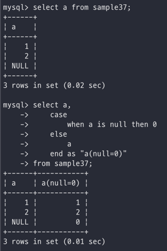
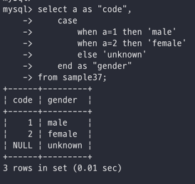
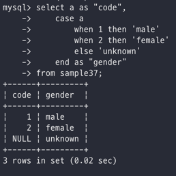

# Day 15

_익히 컴퓨터 언어를 사용하면서 썼던 조건문이다_\


기본적인 형태는 이러하다\


```sql
CASE WHEN 조건식1 THEN 식1
    [WHEN 조건식2 THEN 식2]
    [ELSE 식3]
END
```

함수를 사용해서 데이터를 원하는 형태로 변환하는 경우도 있지만\
여러가지 조건에 따라서 데이터를 다양하게 변환할 때 사용한다\
\
\
\


## CASE 문

자 개념 자체는 그렇게 어려운 개념은 아니다! 그렇기 때문에 명령어의 구성을 한번 확인해보기 위해 다시 한번 틀을 작성해보자\


```sql
CASE WHEN 조건식1 THEN 결과1
    [WHEN 조건식2 THEN 결과2]
    ...
    [ELSE 결과3]
    END
```

우선, WHEN절에서는 참과 거짓을 반환하는 조건을 기술하고 조건식이 참인 경우에 THEN절에 정의한 결과를 리턴해준다\
그렇게 WHEN에 원하는 조건들을 계속해서 써서 조건들을 거르고 거른 후\
어떠한 WHEN에 속하지 않는 경우에는 ELSE로 빠지도록 한다 하지만 굳이 필수값은 아니며 빈값으로 둔다면 'ELSE NULL'로 간주\
\


한 번 사용해보자 -> NULL값을 0으로 반환해보자\
\
이렇게 when절 내부에 a에 대해서 is null이라는 조건을 넣어주고\
when 조건에 걸리는 경우에 then에 결과 값을 넣어주고\
조건에 걸리지 않은 것들은 else로 빼둔다\
\


사실 NULL값을 반환하는 경우에는 COALESCE라는 함수도 존재한다\
위에서의 CASE문까지도 필요없고 단순하게\


```sql
SELECT a, COLESCE(a, 0) FROM sample37;
```

이렇게만 작성해줘도 위와 같은 결과를 내뱉는다!!\


\
\
\


## 또 하나의 CASE문

사실 CASE문은 크게 2가지로 나뉘어지게 된다\
처음으로 언급한 CASE문은 어떠한 조건에 어떠한 행위를 하는 그런 검색 CASE문이라고 볼 수 있고 여기서 나오는 CASE문은 단순 CASE문이다\
\
단순 CASE문은 CASE뒤에 WHEN으로 조건이 들어가는 것이 아니라\
바로 CASE 뒤에 식을 기술하고 WHEN 뒤에 비교할 식을 기술하고 마지막으로 THEN 뒤에 결과를 작성\


```sql
CASE 식1
    WHEN 식2 THEN 식3
    [WHEN 식4 THEN 식5]
    ...
    [ELSE 식6]
END
```

\
일단 식1을 기준으로\
WHEN뒤의 식2와 비교해서 값이 같다면 THEN뒤의 식3을 결과로 내뱉고\
그렇게 쭉 가고 걸리는게 없다면 ELSE로 빠지는 방식\
\


예시로 한번 보자 -> 성별을 문자열로 디코딩하는 과정\
이건 검색 CASE문으로 작성\


\
\


이건 단순 CASE문으로 작성\
\
\
\


## CASE를 사용할 경우 주의사항

CASE문의 장점은 SELECT, WHERE, ORDER BY 이렇게 다양한 곳에서 사용할 수 있는 장점이 있다\
그래도 주의하고 사용할 점들을 나열\
\


#### ELSE 생략

ELSE를 생략하면 위에서도 이야기했지만 ELSE NULL이 된다\
이 의미는 즉 예상하지 못한 데이터가 들어갈 가능성이 많다는 의미이기 때문에\
그만큼 WHEN-THEN절을 꼼꼼하게 짜던가\
그래도 그냥 ELSE로 항상 나머지를 고려하자\
\
\


#### WHEN에 NULL 지정하기

CASE문에서 작성하면서 봤지만 WHEN에서 값을 비교하는데 CASE 밑에서부터 순서대로 WHEN 값을 비교한다\
검색 CASE 문에서는 값을 비교하는데 있어서 값 = 비교할값 이런 식으로 비교했었고\
단순 CASE 문에서는 CASE 문 이후에 작성한 값에 대해서 WHEN 문 뒤에 작성한 값을 자동으로 = 을 통해서 비교하게 된다\
여기서 null값 같은 경우에는 = 을 사용해서 비교하는 것이 아니라 is null 을 사용해서 비교한다는 점을 기억하자\
\
\


#### DECODE NVL

Oracle에서는 디코드를 수행해주는 DECODE라는 함수가 내장되어있고 이것을 CASE 문와 같은 용도로 사용하는 것이 가능하다\


```sql
DECODE(비교하려는 행, 식1, 결과1, 식2, 결과2, ELSE)
```

진짜 CASE문보다가 이런거보면 정신차리기 힘들긴 하지만 표준 SQL문은 아니기 때문에 CASE문을 익히자...\
\
\


\
\
\
\
\
\
\
\
\
\
