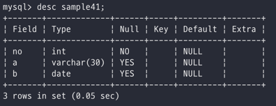
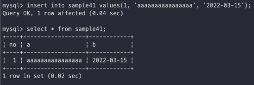
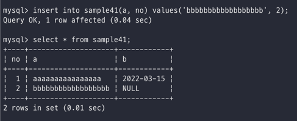
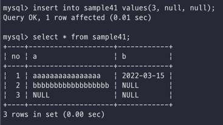

# Day 16

_테이블에 행을 추가하는 방법은 insert를 사용_\

## INSERT로 행 추가하기

RDBMS에서는 INSERT 명령을 사용해서 테이블의 행 단위로 데이터를 추가함\
일단 데이터를 추가하기 위해서 빈 테이블을 봐보자\
예시로 사용할 sample41에는 아무런 데이터가 들어가 있지 않다\
근데 일단 테이블에 어떤 행들이 있고 어떤 데이터 타입을 가졌는지 확인해보는 것이 먼저이다\
\

이렇게 DESC라는 명령어를 사용해서 어떠한 필드가 존재하는지, 어떤 데이터 타입인지 nullable인가 등등 값들을 확인할 수 있다\
값을 집어 넣을 때는 해당 테이블에 대한 정보를 가지고 있어야 insert 해줄 수 있다\
\

값을 집어넣는 방법은 이러하다\
\

INSERT 테이블명 VALUES (필드1, 필드2, ...);\
이렇게 VALUES라는 키워드 뒤에는 삽입하고자 하는 필드의 값들이 들어가 있어야 하기 때문에\
테이블의 구조가 어떻게 되어있는지 파악하고 사용하는 것이 좋다는 점!\

\
\
\

## 값을 저장할 열 지정하기

INSERT 명령을 사용해서 값을 추가하는 경우 값을 저장할 열을 지정하는 것이 가능하다\
위에서는 단순하게 테이블을 설정하고 모든 필드를 채워주는 방식으로 채워줬다면\
굳이 모든 필드를 작성하는 것이 아닌 원하는 필드만 저장하고 싶다면, 테이블뒤에 괄호를 열어서 넣고 싶은 필드만 작성하면 가능하다\
\
이렇게 지정하는 경우에는 필드의 순서를 굳이 맞춰주지 않아도 문제 없이 잘 들어간다는 점!\
만약 따로 언급하지 않은 필드가 존재하는 경우에는 DESC 테이블 이걸로 확인했을 때 봤던 필드의 default값으로 들어가게 된다\
위의 예시에서 b 항목(DATE)에 null값이 들어간 것을 보면 확인할 수 있음\

\
\
\

## NOT NULL 제약

만약에 값을 insert하는데 있어서 null값을 집어넣고 싶은 경우가 있는데, 그럴땐 VALUES에서 NULL이라고 입력해서 값을 지정하는 것이 가능\
하지만 현재 테스트 진행중인 sample41 테이블에 insert into sample41 values(null, null, null) 이렇게 지정해주면\
에러가 나오게 된다 -> 이것은 테이블의 no 라는 필드에 현재 not null제약이 현재 걸려있는 상황이기 때문이다\
그래서\
\
요렇게 집어넣어주면 잘만 들어가는 것을 확인할 수 있다\
제약조건은 항상 사용하기 전에 앞으로 발생할 수 있는 가능성을 최대한 고려할만큼 고려하고 사용하자\

\
\
\

## DEFAULT

이름 그대로의 기능을 가지고 있는 의미이다\
애초에 테이블을 지정하는 과정에서 해당 행의 default값을 설정할 수 있는데,\
이 값들은 만약 데이터를 삽입하는데 있어서 따로 값을 안넣어준 경우에 default값이 자동으로 들어가지게 된다\
위의 예시에서는 default가 null로 되어있기 때문에 지정하지 않은 a 필드와 b 필드에는 default값인 null이 들어간 것을 확인할 수 있음\
\

근데 값을 미지정한 경우에도 default값이 들어가지만! 굳이굳이 **명시적으로** default값을 넣어줄 수 있는 방법이 있다\
insert into sample41 values(4, 'ccccccccc', DEFAULT) 이렇게 값을 넣어주면 기존의 b 필드의 default값인 null이 삽입됨\
\
\
\

\
\
\
\
\
\
\
\
\
\
