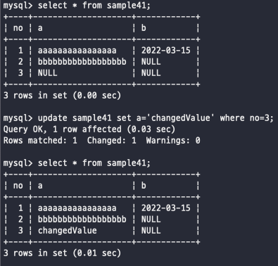
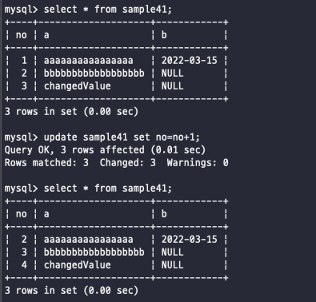

# 삭제하기 - DELETE
데이터를 삭제하는 경우에는 행 단위로 데이터의 삭제가 이루어 진다
<br><br>

## DELETE로 행 삭제하기
데이터를 삭제하는 경우에는 행 단위로 DELETE가 수행되고 기본적인 형식은 이러하다 <br>
```sql
DELETE FROM 테이블명 WHERE 조건식
```
DELETE를 하기 전에는 기존 테이블에 해당 값들이 존재하는지 SELECT를 사용해서 조회를 한 번 해보고 삭제하는 것이 좋다 <br>
만약 조건실을 넣어주지 않고 단순히 테이블만 작성해준다면 해당 테이블의 모든 행을 삭제하라는 의미이다 <br>
조건은 예시로 보면 <br> 
```sql
SELECt * FROM sample42;

DELETE FROM sample42 WHERE no=3;

SELECT * FROM sample42;
```
<br>
여기서 그래도 주의할? 점 으로 보면 직접 쿼리문을 날리는 과정이기 때문에 따로 경고메세지와 같은 건 나타나지 않기 떄문에 <br>
의도 하지 않은 행들이 삭제되는 경우가 생길 수 있으며 조건문에 해당하는 모든 행이 삭제되기 때문에 <br>
항상 삭제하기 전 확실하게 정리하고 진행할 수 있도록 주의해서 사용하도록 하자 <br>
<br><br><br>

## DELETE 명령 구
WHERE 구에서는 대상이 되는 행을 검색하는 것은 SELECT나 DELETE 모두 같다 <br>
단지 SELECT에서는 조건에 맞는 결과만 출력된다면, DELETE에서는 조건에 맞는 결과만 삭제한다는 것이다 <br>
즉, 결과를 보여준다는 것과 단지 쿼리가 성공했다는 이야기만 듣는 것 차이가 있다 위에서 말한 것 처럼 항상 조심해서 사용할 수 있도록 하고 <br>
조건문에서 or 나 and문을 사용해서 삭제하고자 하는 범위를 원하는대로 넓힐 수 있다는 점 <br>
<br>
SELECT와 다른점이 있다면.. order by 구는 의미가 없다는 점? 어짜피 모두 삭제되는 것이기 때문에 상관 없습니다 <br>
<br><br><br><br><br><br>

# 갱신하기 - UPDATE
데이터는 이미 들어가 있는 행을 갱신할 때 사용되는 update 이다 <br>
```sql
UPDATE 테이블 SET 열1=값1, 열2=값2 ... WHERE 조건식
```
<br>

## UPDATE로 데이터 갱신
UPDATE는 셀(필드) 단위로도 데이터를 갱신하는 것이 가능하다 <br>
WHERE 구에서 조건을 맞춰주기만 하면 그에 일치하는 행을 갱신하는 것이 가능하다 <br>
만약 WHERE 구에서 조건을 지정해주지 않는다면 delete와 같이 모든 행이 갱신된다 <br>
<br>
기존의 C, R, D와는 다른 점은 역시 SET 이라는 구가 들어갔다는 점이다 <br>
문법은 **'SET 열명 = 값'** 여기서의 =은 따로 비교연산자로 보는 것이 아닌 프로그래밍 언어에서의 대입 연산자이다 <br>
그리고 만약 테이블에 존재하지 않는 값을 update 하다면 에러가 발생한다 <br>
<br>
역시 한번 보는게 가장 베스트<br>

<br>
이번에 update한 항목은 a이다 -> b라는 필드의 경우는 애초에 DATE 타입이기 때문에 b를 업데이트하고 싶다면 날짜형식을 집어넣으면 된다 <br>
update에서는 보면 where절에서 id와 같은 역할을 하는 no라는 값을 기준으로 where에서 잡고 업데이트를 실행했는데, <br>
사실 update는 delete와 같이 where 절에서 찾은 모든 값들을 업데이트해 준다는 점을 기억하자 <br>
<br><br><br>

## UPDATE로 갱신하는 경우의 주의사항
쿼리 문제에서 자주 나오는 문제인데, update를 치게되면 update를 하기 전에와 하고 난 후에 대해서 생각을 해봐야 한다 <br>
만약에 이러한 쿼리가 나오게 되면 고민을 해봐야 한다 <br>
```sql
UPDATE sample41 SET no=no+1
```
일단 where구가 따로 지정되었지 않기 때문에 전부다 업데이트되는 것이라고 볼 수 있고 <br>
SET에서 보면 기존의 값에서 +1해준 것을 no에 넣으라고 해석할 수 있는데 <br>
갱신되고 나서의 값은 본래 값에서 1을 더한 값이다 <br>
 <br>
실제로 모든 행의 no값이 +1 되어 있다는 것을 확인할 수 있음 <br>
<br><br><br>

## 복수열 갱신
update는 단 하나의 필드만 가능한 것은 아니고 여러 가지의 필드를 한꺼번에 ,(콤마)를 사용해서 업데이트하는 것이 가능하다 <br>
예를 들면 <br>
```sql
--두 구문으로 나눠서 UPDATE 실행
UPDATE sample41 SET a='firstChange' WHERE no=2;
UPDATE sample41 SET b='secChange' WHERE no=2;

--하나로 묶어서 UPDATE 실행
UPDATE sample41 SET a='firstChange', b='secChange' WHERE no=2; 
```
이렇게 콤마를 사용해서 한꺼번에 업데이트 하는 것이 가능하다는 점 <br>
<br>

#### SET 구의 실행 순서
UPDATE sample41 SET no=no+1, a=no; <br>
UPDATE sample41 SET a=no, no=no+1; <br>
이렇게 2개의 쿼리는 2가지의 변경사항을 가지고 있는데 과연 어떤 값 먼저 업데이트가 되는 걸까?? <br>
일단 오라클에서는 따로 값을 나누지 않기 때문에 걱정할 것이 하나도 없다 <br>
하지만 MySQL에서는 다르기 때문에 한 번 알아두자 <br>
<br>
만약 첫 번째 쿼리를 실행하게 되면 no값이 각각 1씩 추가되고 a도 no값과 같게 된다 <br>
만약 두 번째 쿼리를 실행하게 되면 no값을 a에 추가하고 그 후에 값을 추가한다 <br>
그냥 SET에 들어간 변경문이 처음부터 순서대로 차근차근 수행되면서 디비에 바로바로 저장된다는 점이다 <br>
<br>
오라클 같은 경우는 따로 값을 나누지 않는다고 했는데 그 의미는 처리하는 것이 아니라  <br>
update 하기 전에 테이블에서 모든 변경문이 수행되고나서 그제야 디비에 저장이 된다는 점이다 <br>
<br>

#물리삭제와 논리삭제
위에서 데이터를 삭제하는 방법으로는 용도에 따라 크게 물리 삭제, 논리 삭제로 나뉜다 <br>

## 두 종류의 삭제 방법
2 가지의 방법이 있다고해서 삭제하는 방법이 2가지라는 것이 아니라 단지 다른 사고 방식이 다른 것이다 <br>
<br>

물리 삭제 : SQL의 DELETE문을 사용해서 직접 데이터를 삭제하는 방법이다 <br>
단순하게 delete문을 받게되면 자연스럽게 삭제하고자하는 데이터를 찾아서 삭제한다 = 우리가 생각하는 그대로의 삭제 방법 <br>
<br>

논리 삭제 : 테이블에 미리 삭제 플래그와 같은 열을 준비해두고 삭제할 때 테이블에서 실제로 행을 삭제하는 것 뿐만 아니라 <br>
update 명령을 사용해서 삭제 플래그에 삭제한 값을 갱신해두는 방식이다 <br>
이렇게 하면 해당 열에서는 삭제되어 있지만 테이블의 삭제플래그에 삭제된 데이터가 존재는 하고 있기 때문에 <br>
장점으로는 역시 삭제하기 전의 상태로 되돌리는 것이 어렵지 않다는 점이다 <br>
하지만 어떻게보면 그마큼 디비의 데이터를 잡아먹고 있기 때문에 속도가 떨어질 수 있다는 것이 단점이다 <br>
또한 이렇게 세팅해두고 애플리케이션 입장에서 보면 delete를 실행했는데 콘솔에는 update가 뜨기 때문에 혼란스럽다 <br>
<br><br><br>

## 삭제방법 선택하기
삭제 방법을 선택하는데 있어서 지표를 정하는 방식은 서비스에 따라서 다르다 <br>
SNS와 같이 사용자의 개인정보를 다루는 시스템에서는 사용자가 탈퇴하는 경우에는 물리삭제방식을 통해서 다 삭제해야한다 <br>
하지만 주문과 같은 쇼핑몰에서는 주문을 취소했다고 해서 해당 주문을 앞으로 사용하지 않는다는 의미는 아니기 때문에 가지고 있는게 좋다 <br>
그럴때는 논리삭제를 통해서 처리해두면 좋다고 볼 수 있다 <br>
이렇게 각 데이터베이스의 특성에 맞게 삭제 방법을 채택해서 사용하면 좋다 <br>


<br><br><br><br><br><br><br><br><br><br>
