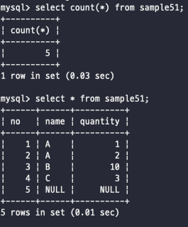
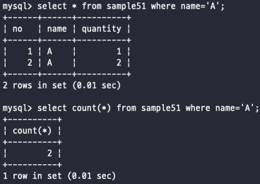

# 행 갯수 구하기 - COUNT
SQL에는 아주 많이 사용하는 대표적인 SQL문이 여러개 있다  
이번에는 COUNT이라는 함수를 볼 것이다  
   

## COUNT로 행 개수 구하기
SQL은 집합을 다루는 집계함수를 제공해주고 일반적으로 함수는 인수로 하나의 값을 지정하는데 비해 집계함수는 인수로 집합을 집어넣는다  
예시로 COUNT 함수는 인수로 주어진 집합의 갯수를 구해서 리턴해준다   

 
이렇게 봐보면 그냥 SELECT를 때려보면 5개의 행이 튀어나오고 COUNT(*) 전체를 조회해보면 5개라고 숫자로 표현해주고 있다  
옛날에도 봤겠지만 *(와일드카드)는 모든 열을 의미하고, COUNT함수에서는 테이블 전체라는 의미로 사용된다  
COUNT는 인수로 지정된 집합의 갯수로 계산되는 것이다  
  

집계함수의 특징은 복수의 값에서 하나의 값을 계산해내는 것이다.  
일반적으로 함수는 하나의 행에 대하여 하나의 값을 반환하는데, 집계함수는 집합으로부터 하나의 값을 반환하고 이렇게  
다수의 집합으로부터 하나의 값을 도출해내는 것을 집계라고 부른다  
그리고 집계함수를 SELECT에 사용하면 WHERE절이 있든 없는 결과값으로 하나의 행만 리턴함  
 

#### WHERE 구 지정

 여기서 보면 WHERE절에 조건을 2개 넣어주고 쿼리하면 2개의 값이 튀어나오지만  
count 함수를 사용하니까 2개의 조건을 세서 2라는 값으로 하나의 행에 출력하고 있는 것을 볼 수 있다  
   

## 집계함수와 NULL 값
COUNT의 인수로 열명을 지정해줄 수 있는데, 이렇게 지정하면 그 열 내부에서 행의 갯수를 구할 수 있다  
이렇게 갯수를 구하는 과정에서 중요한건 NULL에 대한 처리이다 -> 일단 집계함수는 집합 안에 NULL값이 있다면 제외하고 처리한다, 즉 무시한다고 생각 
   

## DISTINCT로 중복 제거
SELECT할때 봤는지 안봤는지는 가물가물하지만 일단 DISTINCT를 사용하게되면 만약 중복된 값이 있다면 중복된 값을 쳐내고 하나만 출력하거나 기준으로 삼는 그런 명령어이다  
뭐 길게 적었지만 중복된 값을 제거하는 함수이고 이걸 사용해서 중복을 쳐내고 사용할 수 있다  
DISTINCT의 반대 예약어로는 ALL이 있다 디폴트값이기도 하기 때문에 그냥 이런게 있다고만 알아두자  
   

          