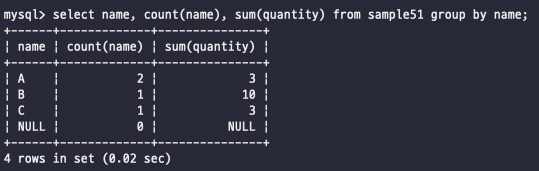

# 그룹화 - GROUP BY
GROUP BY구는 이름 그대로 집합을 그룹으로 나누는 방법이다  
 

## GROUP BY로 그룹화
group by는 특정한 열을 잡아서 그룹화 시킬 수 있다  
name이라는 행을 기준으로 그룹화를 해보자  
  
이렇게 봐보면 일단 그룹화하고 싶다면 그룹화하고 싶은 **행만** select가 가능하다는 점을 볼 수 있고  
그리고 group by를 사용하게 되면 distinct를 걸었을 때처럼 중복된 행은 하나의 그룹으로 묶여서 나오게 된다  
책에서는 group by는 집계함수와 함께 사용하지 않으면 별로 의미없다고 한다..! 그래도 알아는 둬야지  
  
그럼 집계함수에서는 어떻게 쓰는지 보자  
  
일단 name을 기준으로 그룹핑을 했고, 각 name행의 갯수, 각 이름이 가진 값들의 합을 쿼리했다  
name행은 위에서한 것과 같게 name을 distinct하게 가져온 것을 볼 수 있고  
name행의 갯수를 세는데, 일단 count함수는 null을 세지 않기 떄문에 0이 나온 것을 볼 수 있고, A라는 이름을 가진 행이 2개이기 때문에 2가 나온 것을 볼 수 있음  
   

## HAVING 구로 조건 지정
집계함수를 사용하는데 있어서 WHERE절의 조건식에서는 사용할 수 없다는 점이 있는데  
이 이유는 WHERE절이 먼저 실행되고 나서 그 다음으로 GROUP BY절이 실행되는 실행 순서에 대한 차이가 존재하고 있기 때문이다  
내부 처리 순서는 이러하다 : WHERE -> GROUP BY -> SELECT -> ORDER BY  
그래서 집계한 결과를 조건에 맞는 값을 따로 걸러내는 방법이 바로 SELECT에 있는 HAVING절이다 이걸 사용해면 집계함수를 통해 얻은 값을 조건식으로 거를 수 있다 ㅠㄱ
  

HAVING절은 group by뒤에 작성하고, where절과 동일하게 조건식을 지정할 수 있다  
조건식에는 그룹별로 집계된 열의 값이나 집계함수의 계산결과가 전달된다고 생각하면 편하다  
결과적으로 보면 WHERE절으로 검색을 먼저 하고 -> 그것을 그룹화하고 -> HAVING으로 조건에 맞는 것을 찾는 방식이다  
 
  
이렇게 그룹화를 마친 값들을 기준으로 조건을 한번 더 걸 수 있다는 점이다  
HAVING을 봤으니까 내부 처리 순서에 변동이 생긴다
내부 처리 순서 : WHERE -> GROUP BY -> HAVING -> SELECT -> ORDER BY 
 
그룹화보다 더 늦게 처리되는 ORDER BY구에서는 집계함수를 문제 없이 사용하는 것이 가능하다  
하지만 참고로 AS로 별명을 붙힌 것을 order by에서는 사용할 수 없다는 점을 기억하자 별명은 select까지 사용할 수 있는 부분이기 때문에 표준을 기준으로는 사용할 수 없다는 점을 기억하자->MySQL에서는 가능  
   

## 복수열의 그룹화
위에서 group by를 사용할 때 그룹핑할 값만을 select했었는데, 여기에는 이유가 있다  
일단 group by로 어떠한 행을 잡았을 경우에는 그룹핑을 지정한 값 하나만을 가지고 select할 수 있다  
만약에 select name, quantity from sample51 group by name 이렇게 하면 에러가 뜬다는 것이다  
이유는 group by로 그룹화를 하면 클라이언트로 반환되는 결과는 그룹당 하나의 행이다  
group by를 name으로 정렬했는데, select에서 name, quantity를 잡고 있으면 group by처리 후 어떤 것을 반환해야하는지 애매하기 때문에 에러를 뱉는 것이다  
해결방법? 으로는 다른 행을 작성하는 것이 아니라 숫자의 개념인 집계함수를 돌린 값을 집어넣으면 정상적으로 작동한다  
예시로 보면 select name, sum(quantity) from sample51 group by name 이렇게는 잘 작동  
또는 다수의 행을 select해야 한다면 group by에서도 그 다수의 행을 처리해주면 잘 작동한다  
=> GROUP BY에서 지정한 열 이외의 열은 집계함수를 사용하지 않은 채 select 구에 지정할 수 없다  
   

## 결과값 정렬
GROUP BY로 값을 그룹화해도 실행결과 순서를 정렬하는 것은 불가능하다  
데이터베이스 내부 처리에서 같은 값을 그룹으로 나누는 과정에서 순서가 서로 바뀌는 문제가 발생할 수도 있음  
group by로 값을 정렬했다고 하더라도 그룹핑한 값이 아니더라도 order by를 사용해서 정렬하는 것이 가능하기 때문에 필요한 정렬을 사용해서 결과문을 정렬하는 것이 가능하다  
   

          