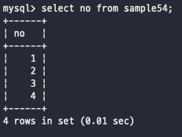

# Day 20

_서브쿼리는 SELECT에 의한 데이터 질의인데, 상부가 아닌 하부의 부수적인 질의를 의미한다_\
\
\
서브쿼리는 SQL 명령문 안에 지정하는 하부 SELECT명령으로 괄호로 묶어 지정한다\
생김새는 select절과 같으며 사용처는 SELECT, FROM, WHERE 등 select 명령의 각 구를 기술할 수 있다\
\
많은 사용처는 SQL명령의 where절에서 사용된다 where 구는 select, delete, update 에서 사용할 수 있는데, 여기 모두에서 서브쿼리를 사용하는 것이 가능하다\
\
\
\


## DELETE의 WHERE 절에서 서브쿼리 사용하기

간단하게 sample54 테이블에서 a 열의 값이 가장 작은 행을 삭제해보자\
그럼 a의 값이 가장 작은 것을 찾아야하는데 그 방법은 MIN함수를 사용해서\


```sql
select min(a) from sample54;
```

이렇게 찾을 수 있고 그렇게 가장 작은 행을 찾고 난 다음에 삭제를 해줄 수 있게 되는데\
이럴 때 사용하는게 서브쿼리이다\


```sql
delete from sample54 where a=(select min(a) from sample54);
```

이렇게 원하는 곳에다가 끼워넣을 수 있다\
\
\
\


## 스칼라 값

서브쿼리를 사용할 때 중요한건 해당 select가 어떤 값을 리턴하는지를 주의해서 볼 필요가 있다\
서브쿼리에는 일반적으로 4가지의 패턴으로 나뉨\
하나의 값을 리턴하는 패턴\
\
\


복수의 행이 리턴되지만 열은 하나인 패턴\
\
\


하나의 행이 리턴되지만 열이 복수인 패턴\
\
\


복수의 행, 복수의 열이 리턴되는 패턴\
\
\
\
SELECT문을 통해서 하나의 값만을 리턴하는 것을 데이터베이스 업계에서는 스칼라값을 리턴한다라고 한다\
근데 왜 스칼라값이라고 부르면서까지 취급을 하는 이유는 서브쿼리로써 사용하기 쉽기 때문이다\
이렇게 스칼라값을 리턴하도록 select문을 작성하고자 하면 select구에서 단일 열을 지정하게 된다. 복수 열을 리턴하고자 하면 3, 4번째가 된다\
\


SELECT에서 하나의 열을 지정하고, GROUP BY를 지정하지 않은 채 집계함수를 사용하게되면 결과는 단일 값이 나오게 된다\
만약 GROUP BY로 그룹하게 되면 몇 가지의 그룹으로 나뉘어질 것이기 때문에 결과적으로 단일 값이 안나올 수 있음\
또한 WHERE 조건으로 하나의 행만 검색할 수 있다면 단일 값이 되므로 스칼라 값을 리턴하는 select문이 됨\
\


대부분 특정한 두 가지가 서로 동일한지를 비교하는 경우에는 단일 값으로 비교하는데,\
이 의미는 where 조건식에서 스칼라 값을 리턴하는 서브쿼리는 = 연산자를 통해서 비교하는 것이 가능하다\
\
\


스칼라 값을 리턴하는 서브쿼리는 특별하게 '스칼라 서브쿼리'라고 부르기도 한다\
기존에 집계함수는 WHERE에서는 사용할 수 없다고 했는데, 스칼라 서브쿼리는 where에서 사용할 수 있기 때문에 집계함수를 사용해서 집계한 결과를 조건식으로 사용하는 것이 가능하다 ㅠr 이외에도 하나의 그룹에 다른 값이 여러 개 존재하는 경우는 스칼라 값이라고 할 수 없다\
\
\
\


## SELECT 구에서 서브쿼리 사용하기

WHERE절 이외에도 SELECT, UPDATE의 SET등 다양한 곳에서 사용할 수 있다\
문법적으로 서브쿼리는 하나의 항목으로 취급한다. 하지만 문법적으로 틀리지진 않았지만 에러가 발생하는 경우가 존재한다\
이러한 에러가 발생하는 이유는 스칼라 값의 리턴에 문제가 생겨서이다. 즉, 서브쿼리를 사용할 때는 스칼라 서브쿼리로 되어있는지 체크\
\


SELECT에서 서브쿼리를 지정할 때는 스칼라 서브쿼리가 필요하다 \
이렇게 각 테이블의 갯수를 서브쿼리로 가져와서 테이블의 상위 레벨에서 select해서 보여주고 있다\
실제 현재는 mysql로 진행하기 때문에 상위 레벨에서는 from을 생략해도 괜찮지만\
Oracle같은 옛날 디비에서는 from을 생략하지 않고 dual테이블을 통해서 사용하면 된다\
\
\
\


## SET 구에서 서브쿼리 사용하기

```sql
UPDATE sample54 SET a = (SELECT MAX(a) FROM sample54);
```

이렇게 set에서 서브쿼리를 사용하는 경우에도 스칼라 값을 반환하도록 스칼라 서브쿼리를 지정할 필요가 있다\
하지만 보면 update에서는 그렇게 많이 쓰이지 않을 것이다\
\
\
\


## FROM 구에서 서브쿼리 사용하기

from에서 서브쿼리를 지정하는 경우도 평소에 사용하는 방법이랑 같다\
하지만 from절에 들어가는 서브쿼리문은 굳--이 스칼라 값을 리턴하지 않아도 괜찮다\
생김새를 보면 그럼 select로부터 select를 하게 되는 것이기 때문에 이러한 구조를 nested구조, 중첩구조, 내포구조라고도 부른다\
서브쿼리는 테이블과 다르게 이름이 없기 때문에 별칭을 사용해서 이름을 지정하는 것도 가능하다 -> oracle에서는 불가능 (as를 안붙힘)\
\
\
\


## INSERT 명령과 서브쿼리

insert와 서브쿼리를 조합해서 사용하는 것도 가능하다\
insert의 value의 일부로 서브쿼리를 사용하는 경우와 value 대신 select을 사용하는 2가지 방법이 있다\
\
\
이때 서브쿼리는 스칼라 서브쿼리로 지정할 필요가 있다. 또한 자료형도 일치해야한다는 점\
\


### INSERT SELECT

\
select를 살짝 억지스럽게 넣긴했지만 이렇게 select로 반환되는 값을 values 대신 넣어줄 수 있다는 점\
아무튼 넣을때 insert할 테이블의 자료형만 같으면 잘 들어간다는 점\
\


insert select명령은 select 명령의 결과를 insert into로 지정한 테이블에 전부 추가한다\
\-> select 명령의 실행 결과를 클라이언트에 리턴해주지 않고 지정된 테이블로 추가하는 것이다 그리고 이 때문에 데이터의 복사, 이동할때 잘 씀\
\
\
\


\
\
\
\
\
\
\
\
\
\
