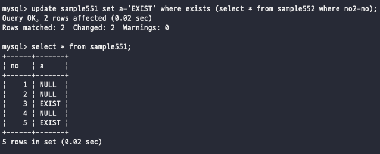
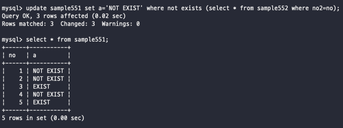
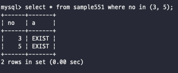
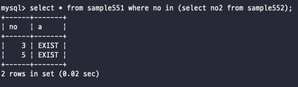

# Day 21

_상관 서브쿼리는 EXISTS 술어로 조합해서 사용하는 방법이다_\


```sql
EXISTS (SELECT 명령)
```

EXISTS 술어를 사용해서 일단 서브쿼리가 리턴해주는 결과값이 잘 존재하는지 확인할 수 있음\
특히 EXISTS 을 사용하는 경우에는 서브쿼리가 반드시 스칼라 값을 리턴할 수는 없다\
EXISTS 는 단순하게 값이 있는지 확인하고 있으면 참, 없으면 거짓을 리턴\
\
\
\


## EXISTS

서브 쿼리를 사용해서 검색하는데 있어서 단순하게 데이터가 존재하는지 아닌지를 판별하기 위해 사용할 수 있다\
예시로 551테이블에는 문자열이지만 5개의 모든 값이 null이 들어가있고, 552테이블에는 3, 5가 존재하고 있는데\
552에 존재하고 있는 숫자에 대한 열에다가는 있음을 적고 나머지에는 없음을 넣어주려고 하는데 이런 경우에 EXIST를 사용해서 쉽게 처리 가능\
\
\
이렇게 EXISTS 술어에 서브쿼리를 지정하면 서브쿼리가 행을 반환할 경우에 참을 돌려준다\
결과가 한 줄이나 그 이상이면 참이되고 반환되는 행이 없다면 거짓이 됨\
\
\
\


## NOT EXISTS

없는 경우에는 NOT EXISTS이다 단순하게 다른 것과 같이 NOT 키워드를 붙힌다고 생각하면 된다\
\
\
\
\


## 상관 서브쿼리

```sql
UPDATE sample551 SET a = '있음' WEHRE EXISTS (SELECT * FROM sample552 WHERE no2=no);
```

위 쿼리를 보면 update(부모)를 치는 곳이 부모이고 where 에서 괄호로 묶은 부분이 서브쿼리이니 자식부분이 된다\
부모 명령에서 551테이블을 갱신하고 자식 명령에서 552테이블의 no2 값이 no와 일치하는 것을 검색하다\
이렇게 부모-자식 구조로 서브쿼리가 특정 관계를 맺는 것을 상관 서브쿼리라고 부른다\
\
참고로 상관 서브쿼리에서 자식 쿼리를 빼서 따로 쿼링해보면 만약 부모 쿼리와 연관되어 있는 경우에는 따로 작동하지 않는다는 점\
\
\


#### 테이블명 붙이기

뭐 위의 경우에는 552테이블의 열은 no2이고 551테이블의 열음 no이기 때문에 문제 없이 no2 = no 이렇게 할 수 있었지만\
만약에 열의 이름이 같은 경우에는 자연스럽게 문법 에러를 뱉기 때문에 조인에서 사용할때처럼 테이블.열 이렇게 테이블. 을 사용해서 지정해줘서 사용\
\
\
\


## IN

스칼라 값끼리 비교할 때는 = 연산자를 사용하지만 집합을 비교하는데 사용할 수는 없다\
그래서 이럴때 사용하는 키워드가 바로 IN이라는 키워드이다\
IN을 사용하게되면 집합 안의 값이 존재하는지 확인할 수 있다 추가적으로 NOT IN 도 사용할 수 있다\
\
서브쿼리를 사용하지 않고 특정 열의 값이 무엇 or 무엇 이라는 조건식을 지정하면 IN을 사용하면 간단하게 지정 가능\
where 조건식을 깔끔하게 in으로 줄일 수 있다는 점\
\
IN 뒤에 집합을 지정해서 왼쪽에 지정된 값이 오른쪽 집합 안에 있다면 참을 뱉는 그런 방식이다\
\
이런 방식 말고도 서브쿼리로도 할 수 있다\
\
이렇게도 서브쿼리로 넣어줄 수 있는데 서브쿼리는 굳이 스칼라 서브쿼리일 필요가 없다 -> in의 특성상 뒤에 집합이 와야하기 때문에 스칼라가 아니여도 괜춘\
\
\


#### IN 과 NULL

집계함수에서는 집합 내의 null을 무시하고 처리되었는데, IN에서는 집합 안에 NULL이 있어도 무시하지는 않는다\
비교하는데 있어서 null = null을 계산할수는 없기 때문에 null을 비교할 수는 없고 IS NULL을 통해서만 가능하다\
또한 NOT IN의 경우, null이 있으면 왼쪽 값이 집합 안에 포함되어 있지 않아도 참을 반환하지 않고 unknown이 된다\
\
\
\


\
\
\
\
\
\
\
\
\
\
