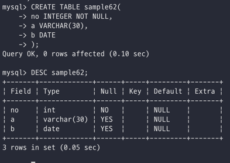
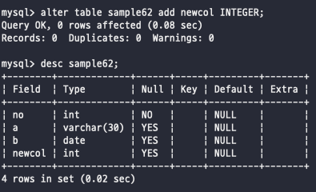
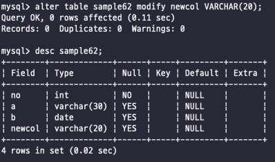
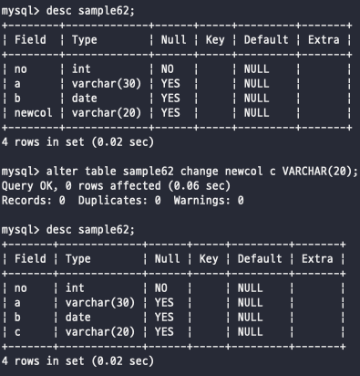
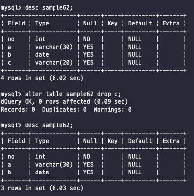

# Day 22

## 데이터베이스 객체

\
처음으로 RDBMS를 설치하게 되면 데이터베이스는 비어있는 상태이고, 여기에 테이블이나 뷰, 인덱스, 프로시저 등의 데이터베이스 객체를 작성해 데이터베이스를 구축해야함\
\
\


### 데이터베이스 객체

데이터베이스 객체란 테이블이나 뷰, 인덱스 등 데이터베이스 내에 정의하는 모든 것을 의미한다\
데이터베이스 내에 실체를 가지는 것을 보고 객체라고 하며\
데이터베이스에 내리는 명령들은 실체를 가지는 개념이 아니기 때문에 객체라는 개념이 아니다\
\


객체에는 이름을 가지고, 데이터베이스 내에 객체를 작성하는데 있어서 겹치지 않도록 해야하는 규칙이 있다\
객체 이외에도 테이블의 열 또한 이름을 가지게 된다\
이름을 명명하는데 있어서 제약 사항들이 존재한다\


* 기존 이름이나 예약어와 중복하지 않는다
* 숫자로 시작할 수 없다
* \_이외의 기호는 사용할 수 없다
* 한글을 사용할 떄는 ""으로 둘러싼다
* 시스텡미 허용하는 길이는 초과하지 않는다

\
\


객체의 이름은 아주 중요하다... 의미 있는 이름을 짓는 습관을 잘 들여두자\
\
\
\


### 스키마

데이터베이스 객체는 스키마라는 그릇 안에 만들어지는데, 위의 객체 같은 경우도 같은 이름의 객체가 있더라도 스키마가 다르면 괜찮다\
대충 여러가지 테이블들을 묶어주는 단위라고 볼 수 있다 그래서 데이터베이스 객체를 '스키마 객체'라고도 부른다\
실제로 데이터베이스에 테이블을 작성해서 구축해가는 과정을 스키마 설계라고 하고 DDL을 사용해서 정의한다\
각각의 스키마 내부에서는 이름을 중복하지 않아야 하는데 이런 부분이라서 스키마를 네임스페이스라고도 한다\
\
\
\


## 테이블 작성, 삭제, 변경

테이블의 조작하는 방법들이 있다\


```sql
CREATE TABLE 테이블명 (열 정의1, 열 정의2)
DROP TABLE 테이블명
ALTER TABLE 테이블명 변경~~
```

\
\


### 테이블 작성

DDL은 모두 같은 문법을 사용한다\
\


```sql
CREATE TABLE 테이블명 (
    열 정의1,
    열 정의2,
)
```

열은 열에 붙히는 이름이고 자료형은 INTEGER, VARCHAR등으로 작성해주고 원하는 DEFAULT값을 설정해주고, NULL을 허용해줄 것인지를 추가해줌\
\
열명 자료형 \[DEFAULT 기본값] \[NULL | NOT NULL]\
이렇게 열을 정의해나가면 된다\
\
\
\


### 테이블 삭제

필요 없는 테이블은 DROP 키워드를 사용해서 삭제\
DROP 키워드를 사용해서 테이블을 삭제하게 되면 테이블 자체가 삭제되게 된다\
행만 삭제하는 방법은 DELETE 키워드를 사용해서 WHERE절로 원하는 조건을 넣거나 아무런 조건을 넣지 않는다면 테이블의 형태는 남고 데이터만 삭제된다\
하지만 DELETE는 매우 처리 속도가 느린 방법이기 때문에 한꺼번에 테이블의 열을 비우고자 한다면 TRUNCATE TABLE 테이블명 이렇게 사용하자\
\
\
\


### 테이블 변경

테이블의 변경은 ALTER 키워드를 사용해서 진행한다\
테이블을 만든 뒤에도 열을 추가하거나 데이터 최대 길이를 변경하는 등 구성을 바꿀 때 사용하면 된다\
ALTER TABLE 명령을 사용해서 처리할 수 있는 것 -> 열 추가/삭제/변경, 제약 추가/삭제\
\
\


**열 추가**

열을 추가하는 방법은 ALTER TABLE 테이블명 ADD 열정의\
CREATE 할때처럼 똑같이 열 정의를 해주면 된다\
\
하지만 이렇게 alter table add로 추가할때 만약 기존에 데이터 행이 존재하고 있으면 모두 기본값으로된다\
하지만 not null 제약이 걸린 열을 추가할 때는 기본값으로 지정해야 한다\
\


**열 속성 변경**

MODIFTY라는 키워드를 사용해서 진행한다\
CREATE처럼, ADD 처럼 작성하되, 열 이름은 변경할수는 없지만 자료형, 기본값, NOT NULL제약 등의 속성 변경 가능\
\
만약 변경하려는 값의 데이터 행이 존재하고 있는 경우에는 속성 변경에 따라서 데이터가 변경된다\
만약 변경할 수 없는 데이터가 있거나 에러가 나면 ALTER 명령 자체가 취소된다\
\
열 이름 변경은 ALTER CHANGE를 사용해서 변경된다\
하지만 ORACLE같은 경우에는 RENAME TO 키워드를 사용한다는 점을 기억하자\
\
newcol 이라는 열 명을 c로 변경하느 모습\
\
열 삭제는 ALTER DROP 을 사용해서 변경한다\
\
c를 삭제한 모습\
\
\
\


### ALTER TABLE로 테이블 관리

최대길이 연장\
alter table으로 사용해서 자료형은 같게, (최대길이) 만 늘려서 명령어를 실행하자\
\
열 추가\
새로운 열을 추가하고 나서 기존에 있던 insert 문들에 주의하자 새로운 열이 들어왔는데 열을 모두 지정하며 insert치지 않았다면 에러를 뱉기 떄문에 주의\
\
\
\


\
\
\
\
\
\
\
\
\
\
