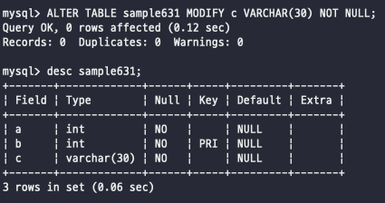
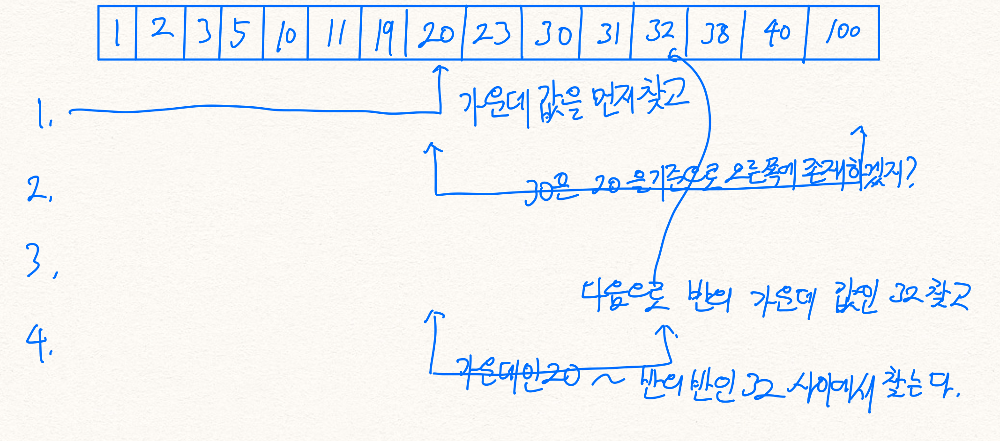
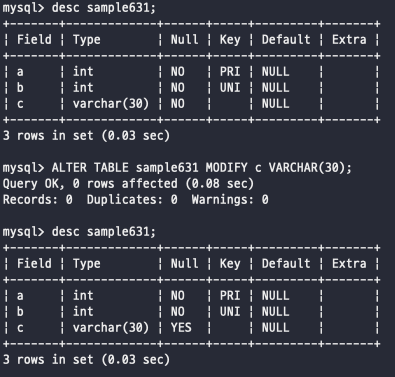
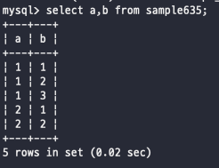

# 제약
기존에 테이블을 CREATE 하는데 있어서 NOT NULL 같은 제약 조건을 걸어줬었는데 이런거를 봐보자 <br>
<br>

테이블에 제약을 설정함으로써 저장될 데이터를 제한하는 것이 가능하다 <br>
위에서 잠깐 이야기한 NOT NULL 이외에도 기본키 제약이나 외부키 제약등이 존재함 <br>
<br><br>

## 테이블 작성 시 제약 정의
제약은 테이블에다가 거는 개념이다 <br>
그래서 CREATE나 ALTER 를 걸때 제약 조건을 걸어준다 <br>
예시로 NOT NULL, UNIQUE를 걸 수 있음 <br>
```sql
CREATE TABLE sample631(
    a INTEGER NOT NULL,
    b INTEGER NOT NULL UNIQUE,
    c VARCHAR(30)
);
```
이것처럼 열에서 직접 각 열에 대한 제약조건을 거는 경우를 보고 열제약이라고 한다 <br>
이외에도 테이블에 테이블제약을 거는 것도 가능하다 <br>
```sql
CREATE TABLE sample632(
    no INTEGER NOT NULL,
    sub_no INTEGER NOT NULL,
    name VARCHAR(30),
    PRIMARY KEY(no, sub_no)
);
```
이렇게 테이블 제약을 거는 것이 가능한데 제약에 이름을 붙히는 것이 가능하다 <br>
제약에 이름을 붙히게 되면 나중에 관리하는데 편하기 때문에 이름은 붙히자 -> 이건 CONSTRAINT 키워드를 사용해서 지정 <br>
```sql
CREATE TABLE sample632(
    no INTEGER NOT NULL,
    sub_no INTEGER NOT NULL,
    name VARCHAR(30)
    CONSTRAINT pk_sample PRIMARY KEY(no, sub_no)
);
```
<br><br><br><br>

## 제약 추가
기존에 생성된 테이블에서도 제약 조건을 추가하는 것이 가능하다 <br>
<br>

#### 열 제약 추가
열 제약을 추가하는 경우에는 ALTER 키워드를 사용해서 정의를 변경하는 것이 가능하다 <br>
ALTER를 통해서 제약을 집어넣는 경우에는 일단 검사를 진행한 후, 그리고 넣기 때문에 검사한다는점 기억하자 <br>
 <br>
이렇게 열을 수정하면서 제약조건을 집어넣어주면 된다 <br>
<br><br>

#### 테이블 제약 추가
테이블 제약을 추가하기 위해서는 ALTER TABLE 의 ADD 명령을 통해서 추가하는 것이 가능하다 <br>
근데 만약 기본키는 테이블에 하나만 설정할 수 있기 떄문에 만약에 미리 설정되어 있는 테이블에 또 기본키를 넣으려고 하면 에러난다는점 <br>
 <br>
<br><br><br>

## 제약 삭제
테이블의 제약은 나중에 삭제하는 것이 가능하다 삭제는 등록할 때와 같은 명령어를 사용한다 <br>
열 삭제하는데 있어서 <br>
 <br>
제약 조건을 빼니까 nullable이 사라짐 <br>
<br>
테이블 제약을 삭제는 ALTER의 DROP을 사용해서 진행 <br>
```sql
ALTER TABLE sample631 DROP CONSTRAINT pk_sample631;
--이렇게 직접 삭제, 근데 mysql에서는 이렇게가 아니라 밑에처럼
ALTER TABLE sample631 DROP PRIMARY KEY;
```
<br><br><br>

## 기본키
기본키 제약을 설정하는데 테이블에 어떤 조건이 있어야할까? <br>
일단 테이블에서 기본키가 될 수 있는 조건은 단순하게 null이면 안된다 <br>
기본키는 테이블에서 단 하나만 존재하고 테이블을 찾는데 지표가 되는 것이기 때문이다 <br>
기본키 제약이 설정된 테이블에서 기본키로 검색했을 때 복수의 행이 나올 수 없다는 의미이다 <br>
그래서 어떻게 보면 행이 유일성을 필요로 한다는 다른 의미에서 유일성 제약이라고도 불리운다 <br>
<br><br>

#### 복수의 열로 기본키 구성하기 
기본키 제약에는 이를 구성할 열 지정이 필요하다 -> 위에서 언급한 것 처럼 not null 제약조건이 설정되어있어야 한다 <br>
일단 기본키를 복수의 열로 지정하게 되면 키를 구성하는 모든 열을 사용해서 중복하는 값이 있는지 없는지를 검사한다 <br>
예시로 a, b를 기본키로 지정했을 경우를 보자 <br>
 <br>
이걸 보면 a값이 중복되는게 몇개가 있어도 a, b 2개를 같이보면 a,b모두 같은 행은 없기 때문에 기본키 제약에 위배되지 않는다 <br>
하지만 이상태에서 a, b 모두 같은 값을 insert하려고 하면 에러가 뜬다 <br>
<br><br><br>

<br><br><br><br><br><br><br><br><br><br>