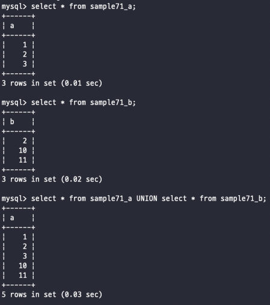

# 집합 연산

관계형 모델에서의 관계형은 수학 집합론의 관계형 이론에서 넘어왔고, 그 의미는 실질적으로 데이터베이스의 데이터를 집합으로 간주해 다루기 쉽게 하자는 것이 지나지 않는다 <br>
<br><br>

## SQL과 집합

집합을 이해하는데 가장 유사한건 뭐니뭐니해도 벤다이어그램이다 <br>
<br>
벤다이어그램에서는 하나의 원이 곧 하나의 집합이다 원 안에는 몇 가지 요소가 있다 <br>
그리고 데이터베이스에서 테이블의 행이 위에서의 요소가 된다 <br>
그래서 예를 들어서 SELECT를 실행했을 때 데이터베이스의 결과를 집합으로 만들어서 줄 때 그 행이 집합에 들어가있는 그런 느낌이다 <br>
<br><br><br>

## UNION 으로 합집합 구하기

합집합은 집합을 더했다는 의미이다 <br>
[1,2,3] 요소를 가진 A라는 집합이 존재하고, [4,5,6] 요소를 가진 B라는 집합이 존재하고 있을 떄 2개의 집합을 합하게되면 <br>
합집합이라고하고 UNION 키워드를 사용해서  A UNION B 이렇게 사용 <br>

<br><br>

이렇게 각 쿼리를 작성하고 두 개의 SELECT 사이에 키워드를 넣어줘서 집합 연산을 진행할 수 있다 <br>
UNION 키워드를 사용해서 합집합을 진행할 때 확인해야하는 점이 있는데 그건 바로 열 구성이다 <br>
열 구성이 다른 테이블을 UNION으로 묶을 수 없다는점을 기억하자 <br>
하지만 방법이 완전하게 없는 것은 또 아니다 -> 위의 예시에서는 * 을 사용해서 모든 열을 가지고 합집합을 진행하려다가 다른 열에서 삑났는데, <br>
열을 따로 지정해서 하면 가능하다는 것 <br>
<br>

SELECT 명령들을 UNION으로 묶을 때 나열 순서는 합집합의 결과에 영향을 주지 않는다 <br>
따라서 order by는 주의해서 사용해줘야한다 <br>

#### UNION을 사용할 때의 ORDER BY

UNION으로 SELECT 명령을 결합해 합집합을 구하는 경우, 각 SELECT 명령에 ORDER BY 를 지정해 정렬할 수는 없다 <br>
ORDER BY 를 지정할 때는 마지막 SELECT 명령만 지정하도록 한다 <br>

```sql
-- 첫 번째 SELECT 명령에 ORDER BY를 지정할 수 없다 
SELECT a FROM sample71_a ORDER BY a
UNION
SELECT b FROM sample71_b;
```

이런 케이스 : 합집합의 결과를 정렬하기 때문에 가장 마지막 SELECT 문에 ORDER BY 를 지정해야 한다 <br>
그래서 정상적인 order by는 <br>

```sql
SELECT a FROM Sample71_a
UNION
SELECT c FROM sample71_b ORDER BY c;
```

이렇게 UNION으로 SELECT를 연결한 경우, 가장 마지막 SELECT 명령에 대해서만 ORDER BY 구를 지정하고 ORDER BY 구에 지정하는 열은 별명을 붙여 이름을 일치 시킨다 <br>
<br><br>

#### UNION ALL
UNION이라는 합집합은 겹치는 부분을 공통요소를 하나만, 중복을 제거한 상태로 출력해준다 <br>
하지만 중복을 제거하지 않은 상태에서 모두 합친 값들을 봐야할 필요가 있을 때 사용하는 것이 이 UNION ALL 이라는 명령어다 <br>
SELECT 을 되짚어보면 중복을 제거하기 위해서는 DISTINCT을 사용했고 기본값은 ALL이였다 <br>
하지만 정확하게 반대라고 생각하면 된다 <br>
UNION 명령어의 기본으로 DISTINCT 처리가 되어있으며, 따로 모든 값을 보기 위해서는 UNION ALL이라는 키워드로 변경해서 사용해야한다 <br>
그렇다고 UNION DISTINCT가 있는 건 아니고 단지 개념 설명을 위해서 말했다는 것 <br>
성능적인 면에서도 무조건 UNION이 빠르다는 것은 아니고 UNION에서는 이미 존재하는 값인지를 검사해야 하기 때문에 <br>
중복값이 없는 경우에는 UNION ALL을 사용하는 것이 성능에서 좋은 성능을 뽐낸다
<br><br><br>


## 교집합과 차집합
교집합은 INTERSECT, 차집합은 MINUS을 통해서 사용 <br>
교집합은 우리가 아는 정말 공통되는 부분만 공통으로 뽑아내는 과정을 의미하고 <br>
차집합은 집합에서 다른쪽의 집합을 제거하고 남은 부분을 의미한다 <br>
이렇게 키워드라도 알고 있으면 언제든 사용가능 하니까 알아두자 -> 하지만 MySQL에서는 지원을 안한다는 거..! <br><br>
<br><br><br>


<br><br><br><br><br><br><br><br><br><br>
