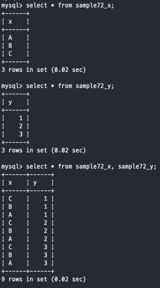

# 테이블의 결합
_테이블을 여러가지 조인하는 방법을 알아보자_
<br><br>

기존에 봤었던 UNION, INTERSECT 등은 테이블의 행을 늘려주는 방식이였다 <br>
하지만 이번에 보는 방식은 열을 늘리는 방식이다 <br>
데이터베이스에서는 데이터를 나눠서 저장하는데, 막상 데이터를 가져오려고 하면 여러 개의 테이블을 묶어서 가져와야하는 경우가 즐비하다 <br>
그래서 테이블을 결합하는 방식에 대해서는 아주 잘 알아둬야 한다는점 <br>
<br><br><br>

## 곱집합과 교차결합
#### 곱집합
곱집합은 합집합이나 교차집합 처럼 집합의 연산 중에 하나로 두 개의 집합을 곱하는 연산 방법이다 <br>
이름은 곱집합, 카티션 프로덕트 등 여러가지 이름이 존재 <br>
곱집합은 말 그대로 각 집합에 있는 모든 요소를 각각 조합한 열을 가지고 있는 테이블을 만들어내는 과정이다 <br>
예를 들어서 <br>
A = {1,2,3} <br>
B = {q,w,e} <br>
A X B = {1q, 1w, 1e, 2q, 2w, 2e, 3q, 3w, 3e} <br>
이렇게 결과가 나온다 근데 모든 데이터를 곱하는 과정을 거치고 그 데이터를 가지고 있는 테이블을 리턴하기 때문에 엄청난 양의 테이블이 나오게 된다 <br>
그래서 실제로 자주 사용하지는 않지만 알아만 두자 <br>
<br><br>

#### 교차결합
교차결합을 하게되면 곱집합의 형태로 테이블의 결과가 나오게 된다 <br>
사용하는 방법은 FROM 절에 곱집합을 진행하고 싶은 테이블을 ,(콤마) 기준으로 기입해주면 된다 <br>
 <br>
이렇게 FROM 에다수의 테이블을 지정하게 되면 교차결합을 진행하게 된다 <br>
<br><br>

#### UNION 과 결합의 차이
**UNION을 통해서 합집합을 만들었을 경우, 세로 방향으로 값이 더해지게 된다** <br>
**FROM 에 테이블을 결합하는 경우, 가로 방향으로 값이 더해지게 된다** <br>
<br><br><br>


## 내부결합
교차결합을 하게 되면 테이블의 열 숫자가 행 숫자대로 열이 기하급수적으로 늘어나기 떄문에 원하는 데이터를 찾는 것이 더 어려워진다 <br>
그래서 자주 사용하는 방식은 내부결합 방식이다 <br>
데이터베이스의 테이블에서는 각 테이블에서 열을 구별할 수 있는 기본키가 존재한다 <br>
내부결합을 하는데 있어서 어떠한 값을 기준으로 공통된 값들을 모두 조인해서 가져오는 방식이 내부결합 방식이다 <br> <br>
예를 들어서 생각해보자 <br>
상품 테이블과 상품의 재고수 테이블이 있다고 가정해보면 <br>
어떠한 상품의 재고수가 몇개 있는지 확인하고 싶다 -> 상품 테이블과 재고수 테이블을 결합해서 값을 찾아야한다 <br>
하지만 문제는 기존의 교차결합을 사용하게 되면 상품 {a,b,c}가 있고 재고수가 {1,2,3}이 있다면 결과테이블에는 {a1, a2, a3, b1, b2, b3, c1, c2, c3}이 나온다 <br>
그러면 상품 a에 대한 재고수를 찾고 싶었지만 상품a와 함께 a에 대한 재고수도 찾고, 상품a와 함께 b에 대한 재고수도 찾고, 이렇게 다양한 값들도 찾게 된다 <br>
그래서 여기서 사용하는 방법이 WHERE절에 기본키가 같다는 조건을 걸어서 불필요한 데이터 이외에, a와 a의재고수 b와 b의재고수, c와 c의 재고수 이렇게 정하는 것이다 <br>
```sql
SELECT * FROM 상품, 재고수;
--위 방식으로는 필요없는 조합의 데이터까지 확인할 수 있다

SELECT * FROM 상품, 재고수 WHERE 상품.상품코드 = 재고수.상품코드;
--이렇게 사용해줘야 해당 상품코드에 맞는 재고수만 나오게 된다 
```
이렇게 내부결합을 사용할 수 있는데, 아직도 원하는 값이외의 것들이 보인다 -> 모든 상품의 재고수가 아닌 B상품의 재고수를 확인하고 싶다면? <br>
위의 WHERE절에 결합조건 이외에도 원하는 조건을 걸어주면 된다 <br>
```sql
SELECT 상품.상품명, 재고수.재고수 FROM 상품, 재고수
WHERE 상품.상품코드=재고수.상품코드 AND 상품명='a';
```
이렇게 두 개의 테이블을 결합하는데 있어서 특정 조건을 거는 것을 결합조건이라고 한다 <br>
<br><br><br>


## INNER JOIN 으로 내부결합하기
기존까지의 결합 방식은 구식결합 방식이다. 최근에는 JOIN 키워드를 사용해서 결합하는 것이 일반적이다 <br>
위의 사례를 INNJER JOIN으로 변경해보자 <br>
```sql
SELECT 상품.상품명, 재고수.재고수
FROM 상품 INNER JOIN 재고수 ON 상품.상품코드=재고수.상품코드
WHERE 상품.상품명 = 'a';
```
INNER는 안쪽이라는 의미이며 JOIN은 결합시킨다는 의미로 합쳐서 내부결합을 의미한다 <br>
그리고 조인에 대한 조건은 ON이라는 키워드를 사용해서 결합조건을 정의 <br>
<br><br><br>

## 외부결합
외부결합이라고 해도 단순하게 교차결합으로 결합조건을 지정해서 결합하는 것은 다르지 않지만 <br>
다른점은 어느 한 쪽에만 존재하는 데이터를 어떻게 가져올지 처리하는 결합 방법이다 <br>
INNER JOIN을 결합하게 되면 양 테이블을 조인하는 조인 조건을 가지고 있는 해당 행만 결합해서 가져오게 된다 <br>
하지만 이러한 방식으로는 추출할 수 있는 데이터가 한정적이다 <br>
그렇기 때문에 외부결합을 사용하는 것이다 -> 외부결합을 사용하게되면 기준으로 잡은 테이블의 모든 값을 결합해서 가져온다 <br>
예를 들면 <br> 
```sql
SELECT 상품.상품명, 재고수.재고수
FROM 상품 LEFT JOIN 재고수 ON 상품.상품코드 = 재고수.상품코드 
```
이렇게 사용하고 JOIN 키워드 앞의 있는 테이블에서는 모든 항목을 가져오고, 뒤에 있는 테이블에서는 조건에 맞는 값만 가져오게 된다 <br>
하지만 이렇게 사용하다보면 INNER JOIN과는 다르게 비어 있는 값, null 이 정말 많긴 하다 <br>
그래서 필요에 의해서 사용하면 된다 <br>
참고로 LEFT의 반대인 RIGHT도 존재한다 이건 뭐 단순히 자리차이 이긴하지만 RIGHT도 존재한다는거 기억하자 <br>
<br><br><br>


<br><br><br><br><br><br><br><br><br><br>