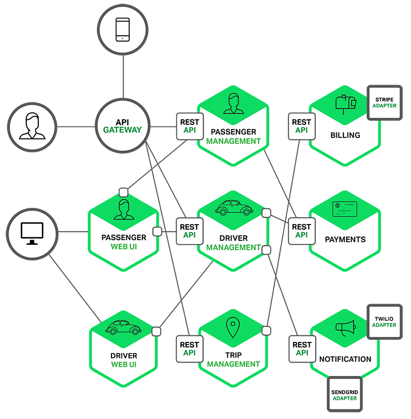

# Microservice Architecture

### Microservice 아키텍처 <a id="MicroServiceArchitecture&#xAE30;&#xBC18;&#xC758;&#xC11C;&#xBE44;&#xC2A4;&#xD750;&#xB984;-&#xC791;&#xACE0;&#xB3C5;&#xB9BD;&#xC801;&#xC73C;&#xB85C;&#xAE30;&#xB2A5;&#xC744;&#xAC00;&#xC9C4;&#xC11C;&#xBE44;&#xC2A4;&#xB4E4;&#xB85C;&#xC774;&#xB8E8;&#xC5B4;&#xC838;&#xC788;&#xC73C;&#xBA70;(&#xAC01;db&#xB610;&#xD55C;&#xB3C5;&#xB9BD;&#xC801;&#xC73C;&#xB85C;&#xC0AC;&#xC6A9;)API&#xC744;&#xC774;&#xC6A9;&#xD574;&#xC11C;&#xD0C0;&#xC11C;&#xBE44;&#xC2A4;&#xC640;&#xD1B5;&#xC2E0;&#xD558;&#xB294;&#xAD6C;&#xC870;&#xB97C;&#xAC00;&#xC9C4;&#xC544;&#xD0A4;&#xD14D;&#xCC98;"></a>

작고 독립적으로 기능을 가진 서비스들로 이루어져 있으며\(각 db 또한 독립적으로 사용\) API을 이용해서 타 서비스와 통신하는 구조를 가진 아키텍처

이상우매니저님이 주신 플랫폼 구성 컴포턴트 리스트를 보고 그림을 보니까 쉽게 이해!!!

여기서 많은 정보를 얻을 수 있었다 : [https://www.nginx.com/blog/introduction-to-microservices/](https://www.nginx.com/blog/introduction-to-microservices/)

독립적으로 배포, 확장 될 수 있는 서비스들을 조합해서 하나의 애플리케이션을 구성하는 방식이다! 그리고 항상 기술 중립적 프로토콜을 사용해서 통신하기 때문에 서비스 구현 기술과는 무관하다.

#### 장점 

* 세부 서비스로 나눠서 작업하기 때문에 서로에게 영향을 끼치지 않고 독립적으로 역할 수행
* 독립적인 서비스로 이루어졌기 때문에, 다른 언어로 변경하는 것도 용이
* 각 컴포넌트는 독립적이기 때문에 독립적으로 배포도 가능하다,
* 각각이 독립적이기 때문에 세부적인 확장도 쉽게 하는 것이 가능하다.
* SRP\(Single Responsibility Principle\) 원리가 잘 적용됨

번외 - 객체 지향 설계의 5가지 원칙\(SOLID\)

*  SRP\(Single Responsibility Principle\) : 하나의 객체는 하나의 기능만 가져야 한다.
* OCP\(Open Closed Principle\) : 확장에는 열려있어야 하고, 수정에는 닫혀있어야 한다.
* LSP\(Liskov Substitution Principle\) : 자식 클래스는 언제나 부모 클래스를 대체할 수 있어야 한다.
* ISP\(Interface Segregation Principle\) : 하나의 일반적인 인터페이스보다 여러 개의 구체적인 인터페이스를 구현하자
* DIP\(Dependency Injection Principle\) : 상위 클래스가 하위 클래스를 의존하지 않도록 구현하자

#### 단점 

* 하지만 각 서비스별로 API을 호출해서 통신하기 때문에 속도가 느리고 오버헤드가 발생할 수 있다. =&gt; 따라서 부분 실패를 처리하는 코드도 따로 처리를 해줘야한다.
* 각 트랜잭션을 유지하는 것이 어렵다.
* 단위별로 서비스가 나뉘어져 있기 때문에 테스트를 진행하더라고 다른 서비스와의 확실한 연동을 보장할 순 없다.

한눈에 알아보기 쉬운 그림

API를 통해서 request가 들어오게 되면 Service Layer에서 받아서 Core Layer에 들어가서 처리해주는 구조

출처 : [https://www.nginx.com/blog/introduction-to-microservices/](https://www.nginx.com/blog/introduction-to-microservices/)

### 모노로식 아키텍처 

기존에 알고 있었던 진행 방식이 모노로식 아키텍처이다. 하나의 패키지 안에 모든 컴포넌트들이 들어있는 방식이고, 한번에 다 빌드해서 배포하는 방식이다.

모노로식 아키텍처는 빠르게 서비스를 만들고 제공할 수 있다는 점과 피드백도 빠르게 받아서 해결할 수 있다는 점이 장점이라고 볼 수 있다.

**단점**

* 하나의 프로세스 내에서 진행되기 때문에 만약에 한 곳에서 에러가 나면, 모든 프로세스가 종료!
* 하나의 커다란 애플리케이션이기 때문에 수정하거나 기능을 추가하기 위해서는 기존의 커다란 애플리케이션에 대한 충분한 이해가 필요하다.
* 프로그램이 크면 클수록 프로그램을 수정해서 실제로 돌리게 되면 시간이 오래 걸린다는 단점이 있다.

한눈에 알아보기 쉬운 그림

출처 : [https://www.nginx.com/blog/introduction-to-microservices/](https://www.nginx.com/blog/introduction-to-microservices/)

